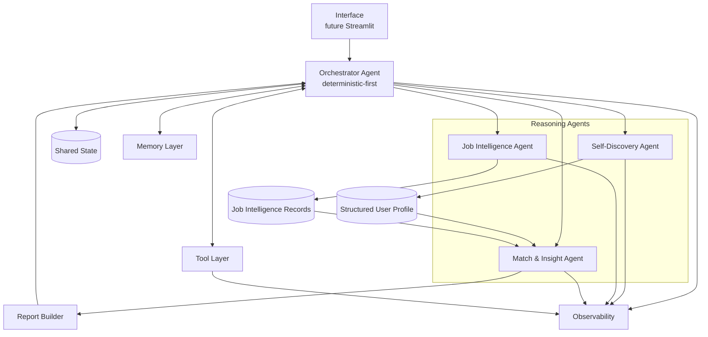
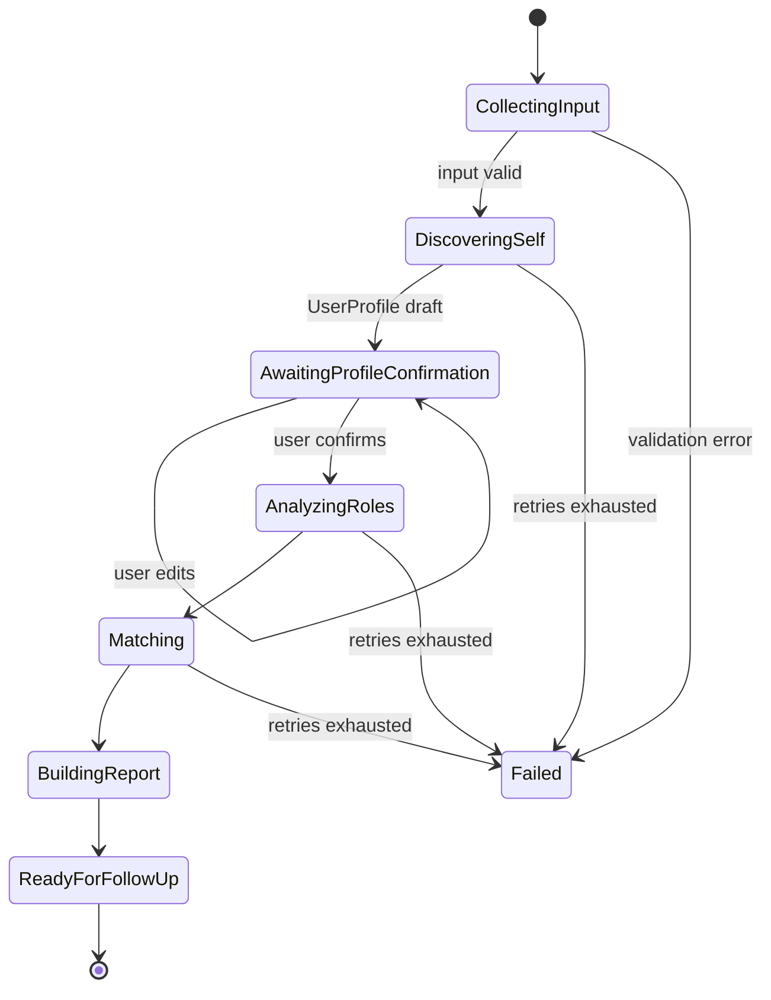
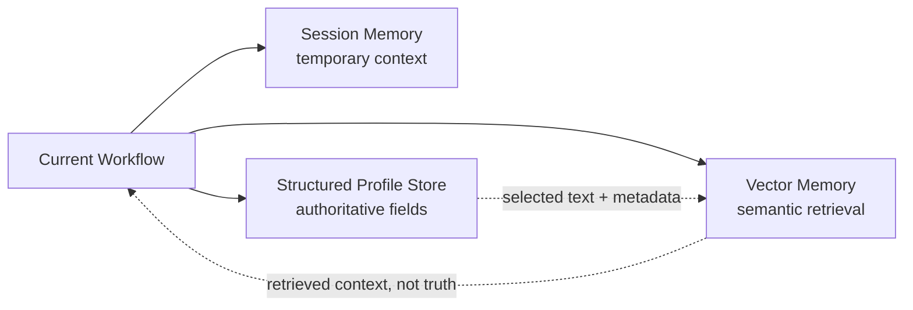
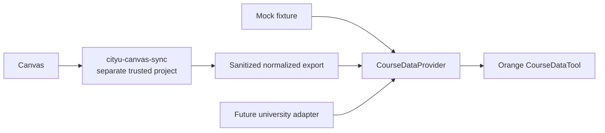
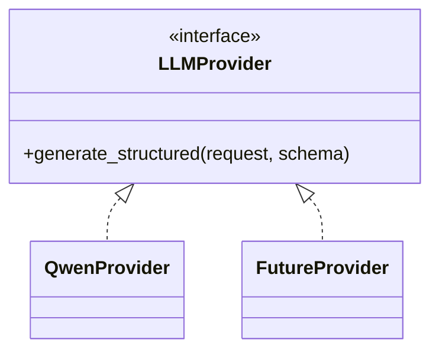
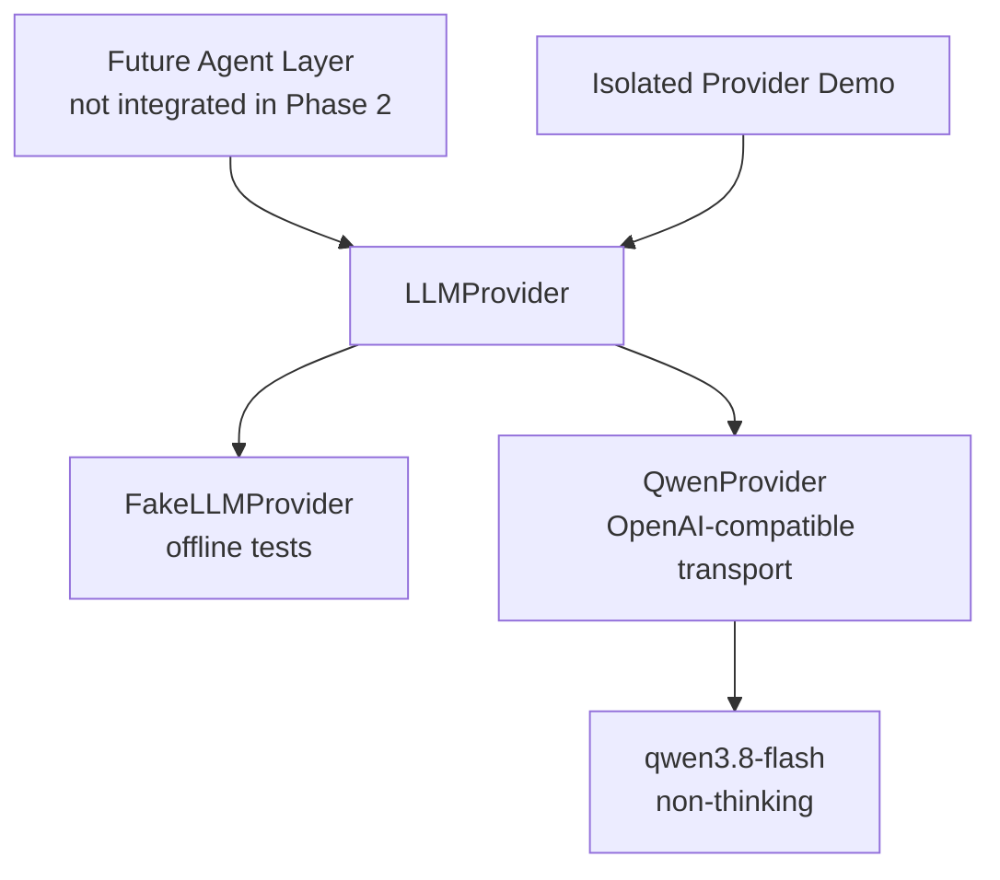
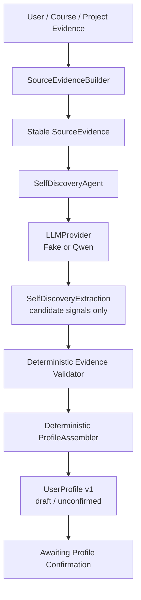

# Orange 系统架构 System Architecture

**状态：Phase 3 Evidence-Backed Self-Discovery；LangGraph、Memory 和 UI 仍未实现。**

## 1. 架构目标

Orange 的架构服务于五个目标：用户保持最终决定权；重要结论可追溯；确定性逻辑与语义推理解耦；数据来源和模型 provider 可替换；公开 Demo 不依赖私有在线系统。首个用例可以来自 CityU 学生，但核心领域模型不得硬编码大学身份。

## 2. 总体架构



Report Builder 是确定性聚合／格式化组件，不是第五个核心 Agent。Orange 固定拥有且只拥有四个核心概念 Agent 角色：Self-Discovery Agent、Job Intelligence Agent、Match & Insight Agent、Orchestrator Agent。

## 3. Golden Flow 与状态门



`AwaitingProfileConfirmation` 是强制门。未经用户确认，工作流不得把草案画像用于最终匹配。未来 LangGraph 应把这些状态和边显式建模，而不是依赖 prompt 暗示流程。

## 4. 核心组件

### 4.1 Orchestrator Agent

负责工作流状态、输入／输出 schema 校验、Agent 与 Tool 调用、路由、超时、重试、错误分类、人工确认门和结果聚合。它主要是确定性编排器；只有确实需要语义分类时才调用模型，并把结果限制在可验证的结构中。

**为什么以确定性为主：**职业建议涉及用户信任和可复现性。若让 LLM 自由决定调用顺序、跳过确认或无限重试，系统行为难以测试、审计和控制成本。确定性状态机能明确允许路径、失败路径与停止条件，同时保留 Reasoning Agent 处理语义任务的空间。

### 4.2 Self-Discovery Agent

读取用户提供的背景以及经授权的课程／项目证据，输出 `CandidateSkill`、`InterestSignal`、`ValueSignal`、优势、发展领域、`Goal` 和 `EvidenceItem` 引用，形成 `UserProfile` 草案。所有重要推断带 provenance 与 confidence；不进行人格诊断。

### 4.3 Job Intelligence Agent

将不同来源的角色／职位信息规范化为 `JobIntelligenceRecord`，解释实际工作、能力要求、职业路径、优势、潜在缺点和工作方式。热度或需求量若未来加入，只是独立元数据，不能替代职业理解。

### 4.4 Match & Insight Agent

比较已确认的 `UserProfile` 与 `JobIntelligenceRecord`。字段校验、权重、阈值和可确定的计算由代码完成；跨表达方式的语义关联、证据综合与自然语言解释可由 LLM 辅助。输出 `MatchResult`、`GapItem` 与 `ActionItem`，同时呈现适配依据和潜在摩擦。

### 4.5 Report Builder

把经过校验的结构化输出组装成中文优先报告。它负责展示层映射、章节顺序、免责声明和引用一致性，不产生新的职业判断。这样可避免格式化阶段偷偷改变结论。

### 4.6 Shared State

`WorkflowState` 是单次工作流的显式状态容器，预计包含 workflow id、阶段、输入摘要、画像版本／确认状态、候选角色、Agent 输出引用、错误和事件引用。状态应可序列化、可测试，并由 Orchestrator 控制变更。

## 5. Memory Layer



- **Session Memory**：当前会话与工作流上下文，生命周期短。
- **Structured Profile Store**：权威、可编辑、可版本化的用户画像；早期可用 JSON，之后可迁移至 SQLite 等结构化存储。
- **Vector Memory**：用于检索历史对话片段、课程／项目描述、职位描述和历史决定等非结构化内容；未来可能使用 Chroma。

**为什么 Structured Profile 与 Vector Memory 分离：**画像字段需要确定类型、版本、用户确认状态和精确更新；向量检索只返回语义近似片段，可能遗漏、过时或排序变化，不能成为权威记录。向量记忆可提供背景证据，但不得覆盖用户确认的结构化事实。Phase 0 不实现任何记忆系统或 Chroma。

## 6. Tool Layer

Tool 是有明确 schema、权限和副作用边界的能力，不等同于 Agent。计划中的抽象包括：

- `CourseDataTool`：读取规范化、已授权的课程／项目资料；
- `JobDataTool`：提供受控职位 fixture 或未来数据源；
- `SearchTool`：未来受约束的外部检索；
- `TextAnalysisTool`：确定性清洗、分段或抽取辅助；
- `ReportTool`：导出或渲染已校验报告。

所有 Tool 调用产生 `ToolEvent`，仅记录安全参数摘要，不记录凭据或完整私有内容。

## 7. Course Data Provider 与 Canvas 隔离



建议未来接口为 `CourseDataProvider`，由 `MockCourseDataProvider`、`SanitizedExportProvider` 或其他大学适配器实现。Orange V1 不读取另一个仓库的 `.env.local`、不共享 Canvas token、不直接调用 Canvas API，也不要求 Demo 时 Canvas 在线。

**为什么隔离 Canvas：**它限制凭据暴露与跨仓库耦合，使公开 Demo 可复现，并让课程来源可以替换。同步系统负责访问控制与脱敏导出，Orange 只消费最小、规范化数据。Phase 0 仅记录此架构。

## 8. LLM Provider 抽象



未来业务层依赖 `LLMProvider` 契约，而非某一 SDK。Phase 2 已实现 `QwenProvider`；其他供应商仅保留为接口允许的未来扩展，不创建 placeholder adapter。配置通过环境变量注入，密钥永不提交。

**为什么抽象 provider：**它允许根据成本、结构化输出能力、区域可用性和可靠性替换模型，也让测试使用 fake provider，而不把业务规则绑在特定供应商响应格式上。

### 8.1 Phase 2 Provider 边界



`providers/base.py` 定义通用结构化生成契约；future Agent 只需了解 messages、Pydantic response model、generation options 与安全 response wrapper，不需要了解 Alibaba base URL、API key、workspace ID 或 transport payload。

Phase 2 在 `providers.demo` 中隔离验证 `ProfileSignalExtraction`；其历史 Prompt 与 Demo 保持不变。Phase 3 在此边界之上注入 `LLMProvider`，Agent 仍不知道 Alibaba base URL、API key 或 transport response。

当前 live adapter 只有 `QwenProvider`；`qwen3.8-flash` 是 Phase 2 Demo 配置，不是永久产品依赖。SDK 内建 retry 被关闭，由 Orange 使用小型、可测试的单层 retry policy。

## 9. Observability

可观测性是结构化运行事实，不是模型的隐藏思维。预计记录：

- Agent 开始／完成／失败；
- 输入来源和安全摘要；
- Tool 选择与安全参数摘要；
- schema 校验结果与结构化中间结果摘要；
- 路由决定及公开的规则原因；
- 使用的 evidence id；
- 重试、错误类别和延迟；
- 在可用时记录 token／模型用量。

示例 UI 事件：

```text
[Self-Discovery Agent]
✓ 读取 5 门课程
✓ 提取 12 个候选技能
✓ 识别 4 个兴趣信号
✓ 生成 UserProfile v1
Evidence: course / project / explicit user statement
```

**为什么展示 execution trace 而非 chain-of-thought：**用户需要知道系统做了什么、使用什么证据、如何路由以及哪里失败，而不是不可验证的内部生成过程。产品只提供可审计事件、公开规则和简洁 decision summary；不得声称暴露 raw/hidden chain-of-thought。

## 10. Interface

未来 Streamlit UI 以中文为主，至少包含：背景输入、画像草案与逐项编辑、明确确认动作、角色洞察、证据与不确定性、能力缺口／行动计划、后续问答、运行事件与错误状态。UI 不能把分数设计成权威排名，也不能隐藏画像确认门。Phase 2 仍未实现 UI。

## 11. 安全与数据边界

- 公共 fixture 与私有本地输入分离；`data/private/` 永远忽略。
- 事件和日志默认脱敏，不记录 secret、完整私密输入或跨仓库凭据。
- 所有外部数据带来源、时间和权限语义；未经授权不持久化。
- 模型输出先校验再进入权威状态；用户明确输入优先于模型推断。
- 报告明确限制、数据时效和“非就业保证”。

## 12. Phase 1 实现映射

- `data/models.py`：Pydantic 领域对象、evidence、event 与 `CareerReport`；
- `workflows/stages.py`：阶段枚举、显式允许边和小型领域异常；
- `workflows/state.py`：可序列化 `WorkflowState` 与确认不变量；
- `workflows/engine.py`：普通 Python 的确定性编排、确认／修订边和失败状态；
- `agents/`：四个核心 Agent 概念；三个推理 Agent 均为 fixture-backed stub；
- `tools/`：本地 mock provider 契约和 deterministic Report Builder；
- `data/fixtures/`：公开安全的小型匿名 Demo 数据；
- `workflows/demo.py`：确认前暂停、确认后完成的离线演示；
- `tests/`：schema、provenance、状态门、事件、序列化、安全和端到端测试。

Phase 1 的 Match & Insight 只做精确技能标签重合，不包含权重或总分。该行为验证状态与数据流，不代表真实职业适配判断。

## 13. Phase 1 历史边界

Phase 1 当时没有 LLM provider／调用、LangGraph、LangChain、Chroma／向量记忆、Streamlit、SQLite、职位检索／抓取、Canvas 调用、真实语义分析、真实匹配权重或开发者个人画像。Phase 2 只新增了隔离的 provider boundary；其他限制继续有效。

## 14. Phase 2 实现与限制

Phase 2 已实现 provider contract、Fake／Qwen adapter、版本化 Prompt、严格 `ProfileSignalExtraction`、evidence-ID 验证、有限重试和安全 usage/latency metadata，并已完成一次 live structured smoke validation。

仍未实现：LLM 驱动的 Job Intelligence 或 Match & Insight、LangGraph、Memory、Streamlit、Canvas／job API 与 tool calling。

## 15. Phase 3 语义／确定性边界



LLM 只理解受控证据并输出候选技能、兴趣、价值、目标、优势、发展领域、职业偏好、不确定性和澄清问题。Python 创建 source evidence、拒绝未知或重复引用、强制 development area 必须有直接缺口证据，并把通过验证的信号映射为领域模型。`ProfileAssembler` 不调用模型，也不添加新语义结论。

这条边界使模型输出始终可拒绝、可替换和可审计。`UserProfile` v1 默认 `confirmed=false`；Orchestrator 仍暂停在 `AWAITING_PROFILE_CONFIRMATION`，Job Intelligence 在确认前不能运行。默认对象图显式注入 `FakeLLMProvider`，只有带 `--live` 的 Self-Discovery Demo 才构造 `QwenProvider`。
