# Orange 系统架构 System Architecture

D.4 Representative Specific Role Understanding 已冻结于 `044c8a2`，继续只做 work-side understanding；D.5 在独立关系合同中读取确认 Profile，不改变 D.4 的工作事实权威。

**当前状态：Online Foundation Pack 1；D.1–D.6 checkpoint `b319c67` 已冻结；完整真实 provider 链保留验证缺口。认证与部署尚未实施。**

## Unified Workspace / Storage Contracts（Pack 1）

`Workspace(storage_adapters=...)` 显式接收 `WorkspaceStorage`，未传时继续使用既有 SQLite 路径。`storage/` 从实际调用抽取 Conversation、Consent、Receipt、Vector、Purge ports，复用既有 StructuredProfileStore/MemoryStore 和 LangGraph checkpoint API。进程内 Ephemeral dictionaries + InMemorySaver 不创建目录/临时 SQLite；持久模式复用现有 stores/savers，不迁移私有数据。

存储持久性与身份、Provider/Source 模式独立；同一四 Agent/runtime 不推断 Guest/Registered。owner/subject-bound facade + shared lease 序列化关闭与写入；Ephemeral close 清除内容并拒绝旧调用/迟到发布。默认 SQLite close 保留本地数据及既有 Conversation/Profile/Memory 只读诊断兼容，不作为未来账户 logout 合同。确认门、expected_current/confirmation_guard、不可变版本、Memory policy/consumer、canonical 向量回查及 D.5/D.6 session-only 不变。不是账户级安全、Guest 页面或 Online Beta；详见 [存储设计与限制](docs/ONLINE_FOUNDATION_STORAGE.md)。

D.6 `evidence_validation` 是 Orchestrator 的 deterministic helper/session，不是第五 Agent。消费已有 Match & Insight validated relation 与 Job Intelligence work scope；独立 exact path/SHA-256 九模板、ONE relation/ONE unresolved scope、generation-bound 延迟发布。Self-Discovery 仍独占未来显式确认；handoff 不执行 start/confirm、不读取简历或新增 Memory consumer。展示/候选/结果/摘要 session-only，Profile/Memory writes=0、D.5 mutation=0，score/ranking=0；不是 skill-gap/test/fit/Learning/Action Plan。详见 [D.6](docs/EVIDENCE_GAP_VALIDATION.md)。

D.5 扩展既有 Match & Insight Agent，独立 `evidence_match` typed projections/session；不把 D.4 转成 JobIntelligenceRecord。复用 scoped IDs/ownership/Fake/版本化 prompt，有限完整陈述验证与确定性解释。Orchestrator/Workspace 管 routing/readiness/lifecycle。零第五 Agent、Profile/Memory writes、新 consumer、fit score/ranking/actions；展示 session-only 不走 append_turn。历史 Golden workflow 不变。详见 [D.5](docs/EVIDENCE_BASED_MATCH.md)。

## v1.3D.4 已冻结边界

现有 dispatcher 最小增加 D.4 路由，`specific_role/` 的严格 model / pinned registry / deterministic service / session 不是第五 Agent。来源独立于 D.3 文本，方向→archetype→代表性角色的双重归属和逐字段 refs 均验证。Binding 绑定 owner/thread、D.1 selection receipt、D.2/D.3 generation/request/fingerprint 与 D.4 source version/fingerprint。只继承父 receipt 一致性检查（含既有 Profile version/fingerprint），个人字段不进入角色事实，没有新 Memory consumer/reads/writes。D.2 仅扩充授权方向问句的有界语法：「整体在解决什么问题」属 PURPOSE，「整体（是）做什么（的）」属 WORK；D.4 的「（平时）一天（大概）怎么工作/过/安排」属工作节奏。仍为全文匹配，无 dispatcher、source/copy/authority 改动。UI 仍在主聊天渐进呈现，消息保留自己的已验证来源，避免切换角色后重新标注历史；无跨 New Chat 或 snapshot/数据库恢复。详见 [D.4](docs/REPRESENTATIVE_SPECIFIC_ROLE.md)。

## v1.3D.3 当前增量边界

有效 D.2 receipt + 明确角色意图 → `RoleLandscapeSession` → 精确 registry → membership-grounded service → 原主聊天 progressive disclosure。`role_landscape/` 属 Job Intelligence 责任，不是新 Agent；Workspace 管 owner/thread/source/parent 与临时生命周期。D.3 不向 QA planner 注册新工具，不读个人字段或 Memory；只继承父 receipt 一致性验证。同线程 QA reload 可保留，导航/关闭/迟到/重放拒绝；不写 chat store/snapshot。D.2 来源与文案不变，仅最小转场/呈现接线。详见 [D.3](docs/ROLE_LANDSCAPE_EXPLORATION.md)。

本说明下方总体图与带 Phase 标签的段落保留 Golden 引导路径及实现演进，不覆盖现有聊天入口的全部能力。Memory 开放 profile refinement、role recall 与 D.1 direction discovery；Job Intelligence、Match relation generation 和 D.2 不消费 retrieved Memory。当前入口见 [README](README.md)，聊天/generation 边界见 [Runtime](docs/ORANGE_AGENT_RUNTIME.md)。

## v1.3D.2 当前增量边界

有效 D.1 selection → Workspace transition → `CareerRealitySession` → 精确 identity/source registry → 确定性 source-supported projection → 主聊天代表性情境/有界追问。`career_reality/` 是 Job Intelligence 责任内的 work-understanding service；Orchestrator/Workspace 管作用域与生命周期，没有第五 Agent。独立公开合成资料不读取 JobRecord 或私人材料，默认不需要 LLM。每条显示内容保留 source/version/claim ref 与 authority；example 不是普遍职业事实，capability 不是用户能力。

独立 D.2 receipt 绑定有效 D.1 选择、owner/thread/request、Profile 版本/指纹、精确方向、source 版本/指纹。普通 QA 清除旧 D.1 review，但有效同线程 D.2 receipt 可继续；新探索、版本变化、导航、删除、关闭和简历上下文清理均失效。Profile 只用于一致性检查，不进入工作解释；Memory 零读取/写入。D.2 timeline、回答及结构化状态不写 transcript/snapshot，普通 QA 继续既有持久化契约。详见 [D.2](docs/CAREER_REALITY_EXPLORATION.md)。

## v1.3C 当前增量边界

本地 PDF/DOCX → 独立简历同意 → 有界 provider context → provenance/material validation → deterministic canonical ResumeEvidence → 临时 Clarification answer → Profile delta → 逐项审核/明确确认 → 同一 SQLite Profile store 的不可变历史与 current pointer。普通组件不增加第五个 Agent；工作经历是一等证据，项目/学历/目标可空。ResumeEvidence/答案/草案不自动取得 Profile 权威，provider normalized_claim 不成为 typed 事实的来源。Profile 确认使用事务内 CAS/guard；curated Memory 仅为用户 opt-in 的独立 post-commit 写入，不是跨存储原子承诺。

聊天 transcript、workflow checkpoint、canonical Profile/Memory 与可重建 vector index 继续分离；候选及原简历只在会话内，确认后的字段/opaque refs 才持久化。generation Stop 先冻结实际可见投影、撤销晚到写权限，再提交 CANCELLED 并释放 UI；本地 cleanup 独立、有界，不保证云端物理取消。本地 owner scope 不是生产认证；无 OCR，PII minimization 不是完整 DLP，grounding 不是履历真实性认证。[验证记录](docs/UNIVERSAL_CAREER_VALIDATION.md)明确离线 PASS、有限 C.1/C.2/B.2 live PASS 和未重验的 C.3/C.4 链；该缺口不阻塞后续范围讨论，不授权新调用。

## 1. 架构目标

Orange 的架构服务于五个目标：用户保持最终决定权；重要结论可追溯；确定性逻辑与语义推理解耦；数据来源和模型 provider 可替换；公开 Demo 不依赖私有在线系统。首个用例可以来自 CityU 学生，但核心领域模型不得硬编码大学身份。

## 2. 总体架构

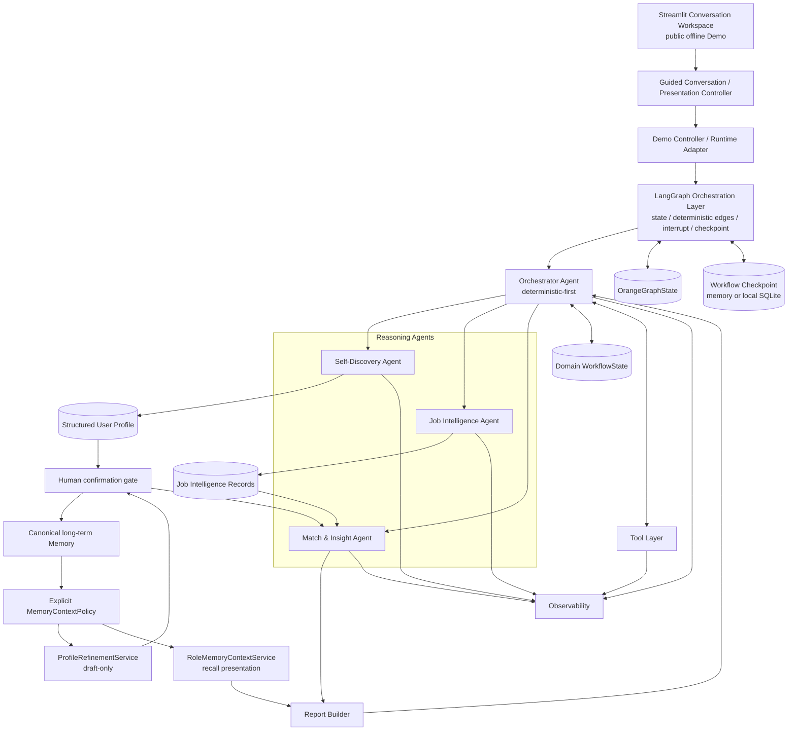

Report Builder 是确定性聚合／格式化组件，不是第五个核心 Agent。Orange 固定拥有且只拥有四个核心概念 Agent 角色：Self-Discovery Agent、Job Intelligence Agent、Match & Insight Agent、Orchestrator Agent。

## 3. Golden Flow 与状态门

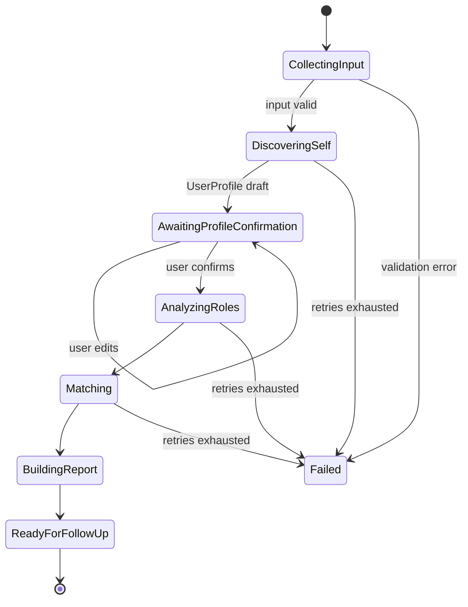

`AwaitingProfileConfirmation` 是强制门。未经用户确认，工作流不得把草案画像用于最终匹配。Phase 6 LangGraph 已把这些状态和边显式建模，而不是依赖 prompt 暗示流程。

## 4. 核心组件

### 4.1 Orchestrator Agent

负责工作流状态、输入／输出 schema 校验、Agent 与 Tool 调用、路由、超时、重试、错误分类、人工确认门和结果聚合。它主要是确定性编排器；只有确实需要语义分类时才调用模型，并把结果限制在可验证的结构中。

**为什么以确定性为主：**职业建议涉及用户信任和可复现性。若让 LLM 自由决定调用顺序、跳过确认或无限重试，系统行为难以测试、审计和控制成本。确定性状态机能明确允许路径、失败路径与停止条件，同时保留 Reasoning Agent 处理语义任务的空间。

### 4.2 Self-Discovery Agent

读取用户提供的背景以及经授权的课程／项目证据，输出 `CandidateSkill`、`InterestSignal`、`ValueSignal`、优势、发展领域、`Goal` 和 `EvidenceItem` 引用，形成 `UserProfile` 草案。所有重要推断带 provenance 与 confidence；不进行人格诊断。

### 4.3 Job Intelligence Agent

把 `JobRecord` 确定性拆为带稳定 ID 的 `JobSourceEvidence`，通过注入的 `LLMProvider` 生成候选 `JobIntelligenceExtraction`，再由 evidence whitelist 与确定性 `JobIntelligenceAssembler` 形成 `JobIntelligenceRecord`。它解释实际工作、能力、技术、工作方式、协作、成长暴露、潜在摩擦与未知信息，但不读取用户画像，也不进行匹配、排名或推荐。

### 4.4 Match & Insight Agent

只比较已确认的 `UserProfile` 与单条 `JobIntelligenceRecord`。确定性 `MatchContextBuilder` 最小化双边信号与证据；LLM 只提出关系／行动候选；确定性 `MatchInsightAssembler` 校验所有 signal/evidence ID、relation-specific 规则和 action policy 后构造 `MatchResult`。Phase 5 不使用权重、总分、适配百分比或跨岗位排名。

### 4.5 Report Builder

把经过校验的结构化输出组装成中文优先报告。它负责展示层映射、章节顺序、免责声明和引用一致性，不产生新的职业判断。这样可避免格式化阶段偷偷改变结论。

### 4.6 Shared State

`WorkflowState` 仍是原有确定性 engine 的显式状态容器。Phase 6 另有 checkpoint-safe `OrangeGraphState`，只保存恢复当前图执行所需的已序列化 profile、selected job IDs、Job Intelligence、MatchResult、CareerReport、安全事件、状态与错误；provider、client、数据库连接、凭据、raw prompt 和完整 source input 均不进入图状态。

## 5. Long-term Memory Layer

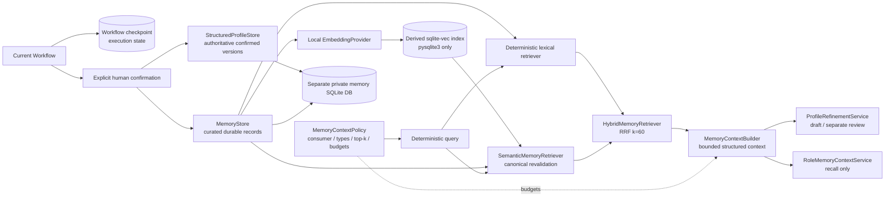

- **Workflow checkpoint**：Phase 6 的可恢复执行状态，使用独立数据库；不是长期记忆。
- **StructuredProfileStore**：confirmed `UserProfile` 的权威、不可变版本历史和显式 current pointer。
- **MemoryStore**：少量 curated facts／feedback／evidence references／insights；不是 conversation transcript。
- **MemoryRetriever**：Phase 7A exact／lexical path 原样保留，始终 subject-scoped 并保留 status 与 provenance。
- **Semantic／Hybrid retrieval**：只为 active confirmed `MemoryRecord` 建立 derived vector；每次命中都回查 canonical store。RRF 只融合 rank，不产生 truth／confidence／fit score。
- **SQLite binding boundary**：canonical `orange_memory.sqlite3` 继续使用 stdlib `sqlite3`；derived `orange_vectors.sqlite3` 单独使用 `pysqlite3 + sqlite-vec`，不替换 `sys.modules["sqlite3"]`。

**为什么 persistence、checkpoint 与 retrieval 分离：**画像字段需要确定类型、版本、用户确认状态和精确更新；workflow checkpoint 只恢复当前执行；retrieval 只回答“什么可能相关”，不能回答“什么是真的”。任何候选或模型推断都不会因 confidence 或 relevance 自动成为 authoritative confirmed memory。

## 6. Tool Layer

Tool 是有明确 schema、权限和副作用边界的能力，不等同于 Agent。计划中的抽象包括：

- `CourseDataTool`：读取规范化、已授权的课程／项目资料；
- `JobDataTool`：提供受控职位 fixture 或未来数据源；
- `SearchTool`：未来受约束的外部检索；
- `TextAnalysisTool`：确定性清洗、分段或抽取辅助；
- `ReportTool`：导出或渲染已校验报告。

所有 Tool 调用产生 `ToolEvent`，仅记录安全参数摘要，不记录凭据或完整私有内容。

## 7. Course Data Provider 与 Canvas 隔离

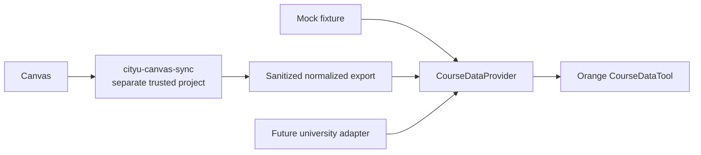

建议未来接口为 `CourseDataProvider`，由 `MockCourseDataProvider`、`SanitizedExportProvider` 或其他大学适配器实现。Orange V1 不读取另一个仓库的 `.env.local`、不共享 Canvas token、不直接调用 Canvas API，也不要求 Demo 时 Canvas 在线。

**为什么隔离 Canvas：**它限制凭据暴露与跨仓库耦合，使公开 Demo 可复现，并让课程来源可以替换。同步系统负责访问控制与脱敏导出，Orange 只消费最小、规范化数据。Phase 0 仅记录此架构。

## 8. LLM Provider 抽象

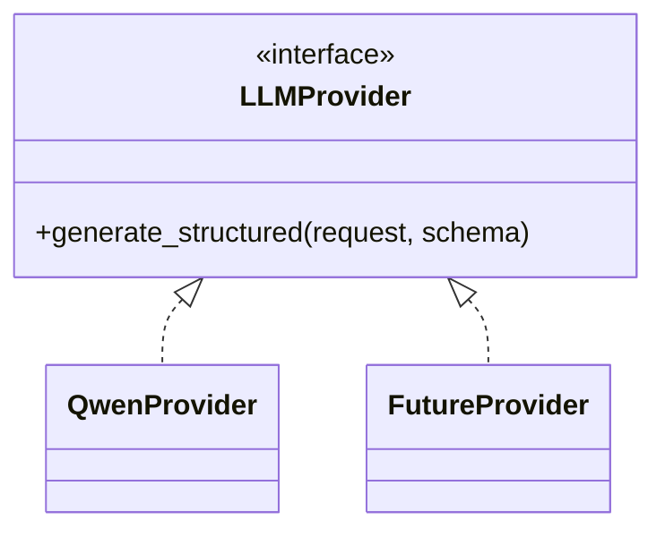

业务层已依赖 `LLMProvider` 契约，而非某一 SDK。Phase 2 实现了 `QwenProvider`；其他供应商仅为未来接口扩展，不创建 placeholder adapter。默认 Demo 与 tests 使用 Fake；live 必须另行明确授权。配置通过环境变量注入，密钥永不提交。

**为什么抽象 provider：**它允许根据成本、结构化输出能力、区域可用性和可靠性替换模型，也让测试使用 fake provider，而不把业务规则绑在特定供应商响应格式上。

### 8.1 Phase 2 Provider 边界（历史隔离 Demo）

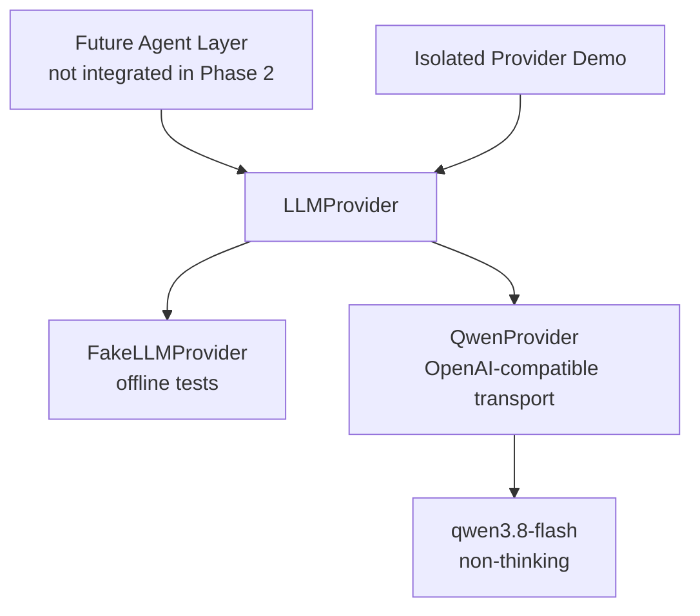

`providers/base.py` 定义通用结构化生成契约；future Agent 只需了解 messages、Pydantic response model、generation options 与安全 response wrapper，不需要了解 Alibaba base URL、API key、workspace ID 或 transport payload。

Phase 2 在 `providers.demo` 中隔离验证 `ProfileSignalExtraction`；其历史 Prompt 与 Demo 保持不变。Phase 3 在此边界之上注入 `LLMProvider`，Agent 仍不知道 Alibaba base URL、API key 或 transport response。

当前 live adapter 只有 `QwenProvider`；`qwen3.8-flash` 是 Phase 2 Demo 配置，不是永久产品依赖。SDK 内建 retry 被关闭，由 Orange 使用小型、可测试的单层 retry policy。

## 9. Observability

Phase 8B 可观测性是内容最小化的执行事实，不是模型隐藏思维。当前 DiagnosticEvent 只允许 opaque run/event IDs、closed component / operation / status、counts、版本、duration 与可用时的 token usage。Collector session-local、bounded；UI 默认折叠，只展示 safe projection。Raw evidence / profile / Memory / query / Prompt / completion / vectors / credentials / CoT 不进入诊断。旧 domain AgentEvent 通过 explicit adapters 转为更窄的诊断，不直接透传任意 summary。

示意（数量仅说明显示类型，不是当前实际运行结果）：

```text
[Self-Discovery Agent]
status: completed
operation: self_discovery
version: v1
duration: measured locally
```

**为什么展示 execution trace 而非 chain-of-thought：**用户需要知道系统做了什么、使用什么证据、如何路由以及哪里失败，而不是不可验证的内部生成过程。产品只提供可审计事件、公开规则和简洁 decision summary；不得声称暴露 raw/hidden chain-of-thought。

## 10. Interface

当前中文 Streamlit 入口为本地持久聊天 shell，包含独立同意门与通用简历审核路径；启动/打开历史不执行模型。保留的 Public Synthetic Golden Demo 使用 fixed guided stages、动态画像、三个等权方向、Match/actions 与临时 stores/Fake providers，不加载私有输入。两者都不是 unrestricted chat 或生产级多用户服务；UI 不定义 authority，不显示总体分／排名。

## 11. 安全与数据边界

- 公共 fixture 与私有本地输入分离；`data/private/` 永远忽略。
- 事件和日志默认脱敏，不记录 secret、完整私密输入或跨仓库凭据。
- 所有外部数据带来源、时间和权限语义；未经授权不持久化。
- 模型输出先校验再进入权威状态；用户明确输入优先于模型推断。
- 报告明确限制、数据时效和“非就业保证”。

## 12. Phase 1 实现映射

- `data/models.py`：Pydantic 领域对象、evidence、event 与 `CareerReport`；
- `workflows/stages.py`：阶段枚举、显式允许边和小型领域异常；
- `workflows/state.py`：可序列化 `WorkflowState` 与确认不变量；
- `workflows/engine.py`：普通 Python 的确定性编排、确认／修订边和失败状态；
- `agents/`：四个核心 Agent 概念；三个推理 Agent 均为 fixture-backed stub；
- `tools/`：本地 mock provider 契约和 deterministic Report Builder；
- `data/fixtures/`：公开安全的小型匿名 Demo 数据；
- `workflows/demo.py`：确认前暂停、确认后完成的离线演示；
- `tests/`：schema、provenance、状态门、事件、序列化、安全和端到端测试。

Phase 1 的 Match & Insight 只做精确技能标签重合，不包含权重或总分。该行为验证状态与数据流，不代表真实职业适配判断。

## 13. Phase 1 历史边界

Phase 1 当时没有 LLM provider／调用、LangGraph、LangChain、Chroma／向量记忆、Streamlit、SQLite、职位检索／抓取、Canvas 调用、真实语义分析、真实匹配权重或开发者个人画像。Phase 2 只新增了隔离的 provider boundary；其他限制继续有效。

## 14. Phase 2 实现与限制

Phase 2 已实现 provider contract、Fake／Qwen adapter、版本化 Prompt、严格 `ProfileSignalExtraction`、evidence-ID 验证、有限重试和安全 usage/latency metadata，并已完成一次 live structured smoke validation。

Phase 2 当时仍未实现：LLM 驱动的 Match & Insight、LangGraph、Memory、Streamlit、Canvas／job API 与 tool calling；后续 Phase 3–6 已分别实现受控领域语义与 LangGraph 编排。

## 15. Phase 3 语义／确定性边界

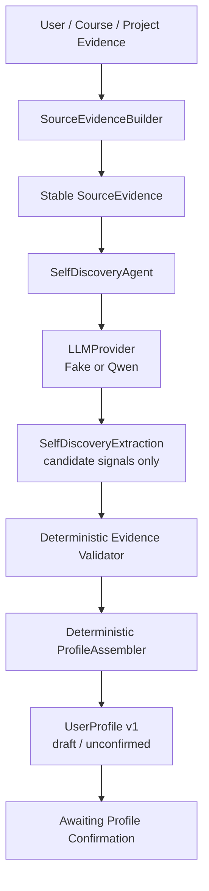

LLM 只理解受控证据并输出候选技能、兴趣、价值、目标、优势、发展领域、职业偏好、不确定性和澄清问题。Python 创建 source evidence、拒绝未知或重复引用、强制 development area 必须有直接缺口证据，并把通过验证的信号映射为领域模型。`ProfileAssembler` 不调用模型，也不添加新语义结论。

这条边界使模型输出始终可拒绝、可替换和可审计。`UserProfile` v1 默认 `confirmed=false`；Orchestrator 仍暂停在 `AWAITING_PROFILE_CONFIRMATION`，Job Intelligence 在确认前不能运行。默认对象图显式注入 `FakeLLMProvider`，只有带 `--live` 的 Self-Discovery Demo 才构造 `QwenProvider`。

## 16. Phase 4 对称证据架构

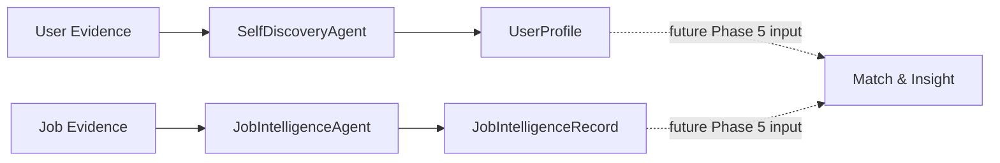

岗位路径的完整边界是：`JobRecord → JobEvidenceBuilder → JobSourceEvidence[] → JobIntelligenceAgent → LLMProvider → JobIntelligenceExtraction → evidence validation → JobIntelligenceAssembler → JobIntelligenceRecord`。LLM 负责有限的语义解释；Python 决定哪些有合法证据引用的字段进入权威记录。

两条分析路径在 Phase 4 刻意独立：`JobIntelligenceAgent.analyze()` 不接收 `UserProfile`。工作流中的画像确认门仍是编排顺序要求，而不是岗位理解的领域依赖。`FakeLLMProvider` 可离线运行全部 20 个 Demo archetype；只有显式 live Demo 构造 `QwenProvider`。缺失的薪资、晋升、work-life、remote policy、team size 或完整技术栈保留为 `JobUncertainty`，不得由模型常识补齐。

## 17. Phase 5 evidence-first Match pipeline

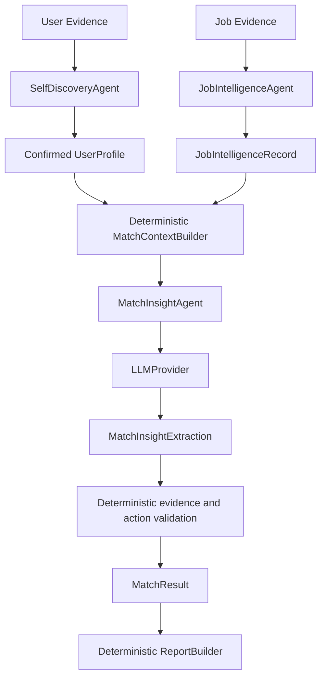

### 17.1 为什么确认画像是硬门

`MatchContextBuilder`、`MatchInsightAgent` 与 `MatchInsightAssembler` 都拒绝 `confirmed=false` 的画像。这样 Self-Discovery 的未确认推断不会在下游被递归放大为职业结论。确认发生在领域边界，而不依赖未来 UI。

### 17.2 为什么没有 overall score

职业关系包含能力、兴趣、偏好、价值观、经验深度、成长暴露与未知信息；把它们隐藏加权为一个数字会制造不可验证的精确感。Phase 5 只提供按 relation type 分组的洞察与命名清晰的 coverage counts，不求和、不排序、不选择最佳角色。

### 17.3 evidence missing 不等于 confirmed gap

`evidence_missing` 表示确认画像目前没有足够材料判断岗位要求，可以触发“验证现有能力”或“建立作品证据”。`confirmed_gap` 必须引用用户明确确认的 development-area 证据，才允许深化能力或获得实践经验。两者在 schema、assembler validation 和 action policy 中分离。

### 17.4 Action 与安全边界

每个 `ActionItem` 必须引用至少一个已验证 issue。action type 与 relation type 存在确定性允许表，target 必须精确出现在用户或岗位 signal 中，因此模型不能凭趋势自由推荐技术。公开 Demo 使用合成 confirmed profile 和 `FakeLLMProvider`；私有 profile 只有开发者在本地 `[y/N]` 门中输入明确 `y` 后才保存到 Git-ignored 路径。

## 18. Phase 6 orchestration-only LangGraph layer

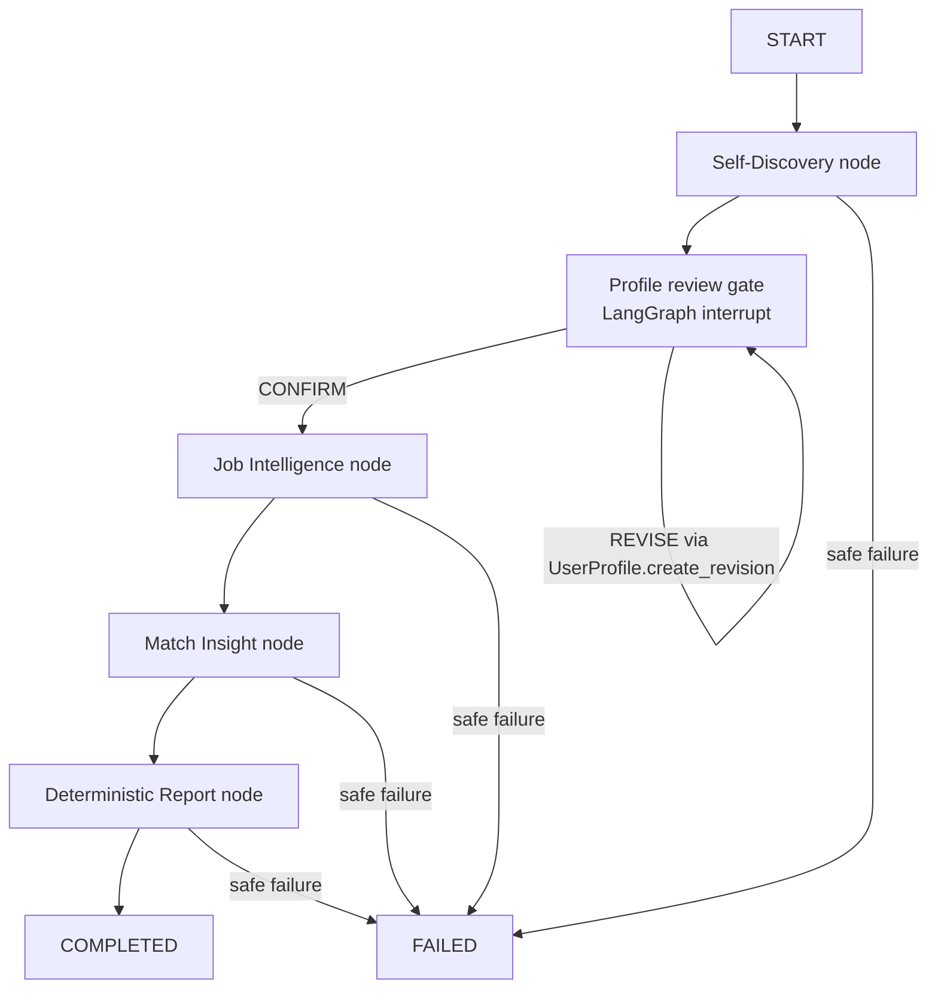

### 18.1 两层权威边界

**Domain / Agent layer** 继续拥有 Self-Discovery evidence building 与 profile assembly、Job Intelligence semantics、Match relation/evidence/action validation，以及 deterministic report assembly。**Orchestration layer** 只拥有 node sequencing、确定性 edges、`interrupt`／`Command(resume=...)`、stable opaque thread ID、checkpoint、execution status 与 sanitized failure routing。图不构造 `QwenProvider`，不让 LLM 选择边，也不重新实现 Agent 语义规则。

原有 `DeterministicWorkflowEngine` 被保留为 framework-independent 回归基线。LangGraph 和旧 engine 调用相同领域组件，不维护两份业务逻辑。

### 18.2 Human-in-the-loop 与恢复

Self-Discovery 完成后，图状态变为 `WAITING_FOR_HUMAN` 并在 `profile_review_gate` 触发真实 LangGraph interrupt。安全 payload 只有 profile labels、goal types、不确定性和澄清问题，没有 evidence 原文、source input、prompt、凭据或隐藏推理。`CONFIRM` 调用既有 `UserProfile.confirm()`；`REVISE` 只运输最小 `education_summary` 变化并调用既有 `UserProfile.create_revision()`，因此旧版本不变、新版本递增且保持 unconfirmed，再次进入 review interrupt。

### 18.3 Checkpoint 不是长期记忆

自动测试和短期 public Demo 使用 `InMemorySaver`。手动本地 restart/resume 使用同步 `SqliteSaver`，路径为 Git-ignored 的 `data/private/runtime/orange_workflow.sqlite3`，连接通过 context manager 打开和关闭。SQLite 中的是当前 workflow execution state；它不是 session history、structured profile store、vector memory、semantic retrieval 或 Phase 7 Memory Layer。

### 18.4 可恢复性与调用所有权

同一 opaque `workflow_id` 同时作为 LangGraph `thread_id`。恢复前 runner 验证 checkpoint 存在、状态为 `WAITING_FOR_HUMAN` 且确有 interrupt，避免错误 thread 静默继续。节点不添加 graph-level semantic retry；provider retry 所有权仍在既有 provider policy。SQLite runner 重建后从 review checkpoint 继续，Self-Discovery 不会因确认恢复而再次调用。

## 19. Phase 7A structured and persistent memory

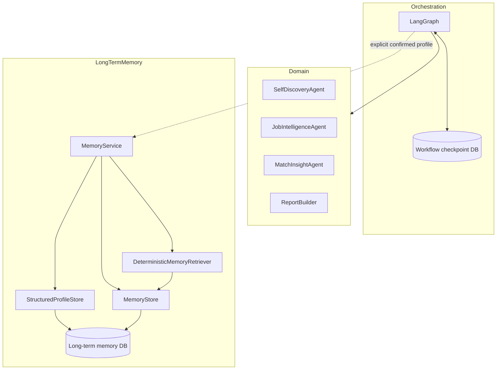

### 19.1 数据库与职责边界

Workflow checkpoint 位于 `data/private/runtime/orange_workflow.sqlite3`，只恢复图执行。Long-term memory 位于独立的 `data/private/memory/orange_memory.sqlite3`，保存 confirmed profile versions 与 curated MemoryRecords。两个数据库不共享 schema；`purge_subject()` 只清除 long-term memory，绝不静默删除 workflow checkpoint。

### 19.2 Profile authority 与 immutable history

只有 confirmed `UserProfile` 可以进入 `StructuredProfileStore`。`(subject_id, profile_id, version)` 是不可变唯一身份，current pointer 单独保存；新版本移动 pointer 而不覆盖旧版本。相同语义版本重复写入是幂等操作，冲突 payload 或 version regression 会安全失败。读取时必须重新通过当前 `UserProfile` schema。

### 19.3 Curated MemoryRecord lifecycle

`MemoryStore` 只保存明确创建的 durable records，不自动复制完整 profile、MatchResult 或 chat transcript。`CANDIDATE → CONFIRMED` 需要显式 user confirmation；confidence 不影响 authority。`CONFIRMED → SUPERSEDED` 保留旧记录与 replacement link；`CANDIDATE／CONFIRMED → ARCHIVED` 保留历史但退出 active retrieval；hard purge 才实际删除 subject-owned rows。

### 19.4 Retrieval relevance 不等于 factual authority

Phase 7A retriever 先执行 subject、status、type 与 exact metadata filter，再按规范化 phrase／token overlap 确定性排序。默认只读取 active `CONFIRMED` records，并在结果中保留完整 status、source type、confidence、timestamps 与 supersedes relation。Candidate、superseded 与 archived history 只有显式 history request 才可检索。Phase 7A 没有 embeddings、vector index、sqlite-vec 使用或 LLM reranking。

### 19.5 最小 workflow integration

`MemoryService` 通过 graph dependencies 注入，不进入 `OrangeGraphState` 或 checkpoint。显式 `CONFIRM` 后，graph 可幂等保存 active profile，并仅在 state 中保留 opaque `subject_id` 和小型 profile reference。Persisted profile 不会自动跳过下一次 Self-Discovery／profile review；未来产品 policy 必须另行明确决定是否加载。

## 20. Phase 7.5 presentation adapter

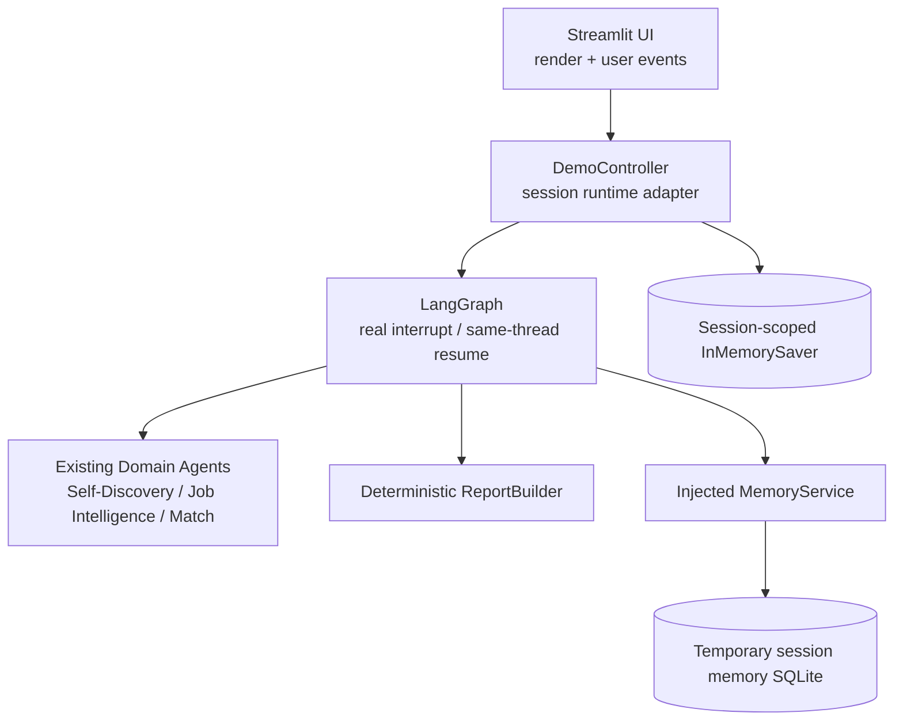

Streamlit 是 presentation adapter，不拥有业务语义。`ui/app.py` 只接收用户点击、维护页面／selected-role 等 browser-session coordination，并渲染安全结果；`ui/demo_controller.py` 负责组装现有 public offline dependencies、启动 graph、读取真实 interrupt、以 `ProfileReviewDecision(CONFIRM)` 恢复同一 thread，以及重新验证 completed outputs。

每个 browser session 独立持有 controller、`InMemorySaver`、opaque workflow/subject IDs 和 temporary memory directory。它们不进入 `OrangeGraphState`，也不使用 Phase 6／7A 的 private persistent databases。Reset 只关闭当前 temporary memory 并建立新 session runtime。

Presentation mappings 只把 domain enums 与已验证对象转换成中文标签／cards。Job cards 来自 `JobRecord`／`JobIntelligenceRecord`；insight groups 来自 `MatchResult`；actions 原样展示权威 `ActionItem`；Memory summary 读取 `MemoryService`。UI 不计算 overall score、角色排名，不重新生成 action prose，也不创建额外 confirmed memory。

Phase 7.5 默认只选择 `job_001`、`job_007`、`job_013`，对应 AI Product Intern、AI Application Engineer 与 Data Analyst。所有 provider 均为 `FakeLLMProvider`，Streamlit telemetry 关闭，server 默认绑定 localhost；没有 private mode、live provider、external data 或 vector retrieval。

## 21. Phase 7.6 conversation-first presentation architecture

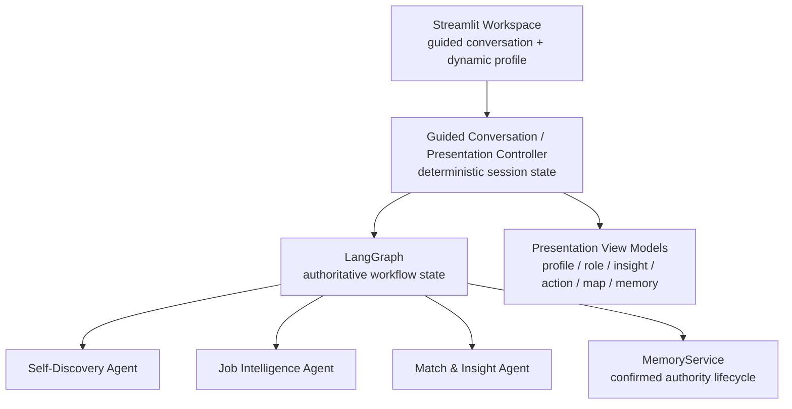

`ConversationStage` 只描述产品如何逐步收集有限选择与可选短文本。它不调用 provider、不选择 graph node，也不成为第二套 Self-Discovery／Match workflow。完成 guided discovery 后，controller 才启动现有 graph；profile review、confirmation/revision、Job Intelligence、Match 与 Report 仍以 LangGraph 和既有 domain contracts 为权威。

动态画像通过 presentation models 区分「已有证据」「用户刚刚表达」「待确认」「尚不确定」。Guided answer 可丰富当前 public synthetic session，但不会凭 UI 标签生成历史证据。Profile confirmation 继续使用真实 interrupt／same-thread resume；三个岗位只在确认后作为「值得探索的方向」出现，固定 layout 不表达排名。

Role clarification 与 action status 属于 session interaction。Clarification 默认不写 Memory；只有用户明确选择保存时，controller 才经 `MemoryService.record_user_feedback(..., confirmed_by_user=True)` 写入该 browser session 的 temporary DB。Role deprioritization 只进入 Exploration Map，不修改 `MatchResult` 或生成 gap。Action task view 以 validated `ActionItem.rationale`、description、target、related insights 与 expected evidence 为权威，只叠加按 `ActionType` 固定的执行步骤和 session status。

Phase 7.6 view models 包括 `CareerProfileView`、`CareerDirectionCardView`、`MatchInsightGroupView`、`ActionTaskView`、`ExplorationMapView` 与 `MemorySummaryView`。它们只能转换显示，不得回写 domain object。Reset 关闭当前 temporary DB，并替换 conversation、workflow、subject、checkpointer、role feedback、action status 与 exploration state。Phase 7.6 不包含自由聊天、LLM routing、live provider、private mode、external jobs、Canvas 或 vector retrieval。

## 22. Phase 7B semantic and hybrid retrieval

```mermaid
flowchart TB
    CM[(orange_memory.sqlite3<br/>stdlib sqlite3<br/>canonical authority)] --> AC[active confirmed MemoryRecord]
    AC --> EP[EmbeddingProvider<br/>Fake tests / local FastEmbed runtime]
    EP --> DV[(orange_vectors.sqlite3<br/>pysqlite3 + sqlite-vec<br/>derived only)]
    DV --> SR[SemanticMemoryRetriever]
    SR --> CV[canonical get + subject/status/hash revalidation]
    CM --> LR[Deterministic lexical retriever]
    CV --> HR[HybridMemoryRetriever]
    LR --> HR
    HR --> RRF[one-based RRF k=60<br/>score = Σ 1/(60+rank)]
    RRF --> CB[MemoryContextBuilder<br/>max records + character budget]
```

Vector entry 只持有 opaque `memory_id`／`subject_id`、type、provider／model／dimension、content hash、indexed timestamp、schema／normalization version 和 vector；被 embed 的文本严格为 `memory_type + newline + content`，不包含 ID、时间、profile、evidence document、transcript、credential 或 hidden reasoning。

RRF 对两个来源都使用一基 rank，固定 `k=60`。排序依次为 fusion score 降序、best source rank 升序、canonical `created_at` 升序、`memory_id` 升序；同一 Memory 去重并保留 `lexical_rank`、`semantic_rank`、`fusion_rank`。RRF 数值只供 deterministic ordering，不是事实 confidence、career fit 或 authority。

Lifecycle coordination 在 canonical write 成功后更新 derived index。跨两个文件不存在单一 SQLite transaction：index failure 不回滚或否定 canonical authority，而是留下 safe diagnostic，随后可 rebuild；purge 先删除 canonical long-term data，再删除 subject vectors，vector cleanup failure 标记 `cleanup_required`。Workflow checkpoint DB 永远不属于该 purge。

`MemoryService.retrieve_context()` 是唯一新增的显式未来 integration surface。四个 Agent 与 LangGraph 均未自动调用它；删除／损坏 vector DB 时 canonical read/write 继续工作，hybrid retrieval 可明确降级为 lexical-only mode。

## 23. Phase 7C explicit context consumption

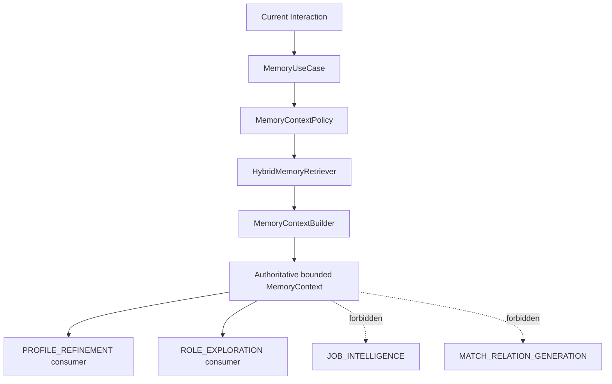

`MemoryPolicyRegistry` 固定每个 use case 的 MemoryType allowlist、retrieval mode、top-k、record／character budget、session-input query policy 与唯一 consumer。`MemoryQueryBuilder` 只做确定性构造；safe trace 记录 use case、count、type、opaque Memory ID 和 lifecycle result，不记录 raw query、raw Memory content、vector、profile JSON、credential 或 hidden reasoning。

Profile refinement 明确保留三层：当前 session input 是本次会话最新表达；confirmed current profile 是当前画像权威；active confirmed Memory 是历史权威。`ProfileRefinementService` 只产出 draft revision 与带 `memory_refs` 的上下文 statement，不能确认画像。显式 Profile Review 后才由 `StructuredProfileStore` 保存新 confirmed version；旧 profile version 保留。

Structured change detection 只读取带 `signal_dimension`、`signal_value`、`signal_version` metadata 的 active confirmed Memory，并只比较同维度、已注册 value。`MemoryChangeCandidate` 只存在于 session；free-text semantic similarity 永远不创建 contradiction／change。Update command 经现有 `MemoryService.supersede()` 写 canonical history并触发 derived vector lifecycle；defer／uncertain 对 canonical Memory、vector index 与 profile 都是零写入。

Role recall 与 post-Match follow-up 是独立 presentation context。前者不改 `JobIntelligenceRecord`；后者不改八类 `MatchResult` relation。任何由 Memory 引起的个性化 statement 都必须在呈现前重新解析同 subject、active confirmed 的 `memory_refs`；stale ref 会被拒绝。

## 24. Phase 8A external evaluation observer

`GoldenScenario registry → isolated runner → existing production adapters → structured observations → deterministic checks → safe JSON/Markdown report`。

Evaluation 包位于生产依赖图之外。三层分别验证 contract、semantic Golden case、E2E journey；不增加 Agent，不改变 Prompt/LLM/schema/Memory authority 或 UI。Adapters 只执行既有 Self-Discovery/JI/Match、MemoryService、GuidedConversation、DemoController 与真实 graph，检查器不生成关系或 repair 结果。

每个 scenario 使用独立 FakeLLMProvider/FakeEmbeddingProvider、memory checkpointer、临时 canonical/vector DB 和 subject。读取 Memory 前后比较完整 canonical history/status/timestamps 与 vector metadata snapshot；current input、defer、显式 supersede 和另行 profile v2 confirmation 分别观察，不把 Memory recall 视为 Match 修改许可。

Offline accident guards 在执行期间阻断网络、live/model constructors、私有文件与 root 外数据库；attempt 即使被捕获仍为 BLOCKING FAIL。全部测试不需要 credentials。默认报告只持有 checks/findings 与安全 run metadata，observations 不持久化。没有 judge、overall quality score、Match score 或角色 ranking。

## 25. Phase 8B local diagnostics observer

`session/scenario owner → ObservabilityContext → scoped ContextVar → coarse measured span / legacy event adapter → strict DiagnosticEvent → bounded in-memory collector → safe projection → collapsed Developer Trace`。

四个 Agent 的职责、domain models、Prompts、Memory authority 和 Match semantics 保持不变。原 AgentEvent/ToolEvent/GraphEvent/MemoryEvent 不迁移、不删除；adapter 明确投影 allowlisted fields 并保留 `source_event_type`，不复制 summary/text。高价值方法只增加有 scope 才启用的薄 decorator。Standalone 原调用不建立隐式 global collector。

DemoController 持有自己的 collector 和 opaque run/thread/subject identity；evaluation runner 每个 scenario 独立 collector/context，不向 UI collector 写入。`diagnostic_scope` 用 token/finally 恢复 ContextVar，HITL resume 保留 logical run，新的 measured root span 表示恢复操作。parent 指向同 run 的 start event；timestamp 用 timezone-aware UTC，duration 用 monotonic perf_counter，root duration 不双计子 span，不包括等待用户的时间。

Recorder failure 只累加安全 `recording_failure_count`，不改变业务返回／原异常；collector 有 4000-event 上限且返回 deep copy。长期不重置会截断后续诊断，显式计数而非静默成功。无 telemetry DB、global singleton、cloud trace 或 exporter。Observability 描述发生了什么；evaluation 判断是否符合规则，两者不互相代替。

报告只新增 `diagnostic_run_id` 和最多八个 `related_event_ids`，不嵌入事件。动态 ID 在独立 scenario deterministic snapshot 中排除，在完整报告 serializer 中显式加入，保持原 scenario comparisons 可重复。发生 synthetic failure 时可定位 scenario → run → failed evaluation-check event；EVALUATION event 不是新的 production failure taxonomy。

## 26. Phase 8C presentation-only visual system

Production semantics → `ui/presentation.py` 的既有只读 presentation models → `ui/components.py` + `ui/visual_system.py` 的 Orange UI component system → Streamlit。

视觉系统只定义有限 tokens、escaped badges/panels、固定 journey grouping／transition copy 和 CSS。`ui/app.py` 只调整信息层级、轻量导航文案、details disclosure、CTA、safe error 与 reset feedback。原生 columns 保留，窄屏 CSS 堆叠；依据／历史／诊断次要，不隐藏权威边界。

UI 不定义 authority。Agent/domain models／prompts／workflow gate／DemoController／Match relations／Memory lifecycle／evaluation／observability backend 均冻结。Journey 不路由，badge 不确认，current/history 展示不 supersede；Action 状态不证明技能；diagnostic metric 只是执行数／实测时长，不是产品适配分。无新 core data contract、Agent、持久化、provider 或 frontend dependency。
