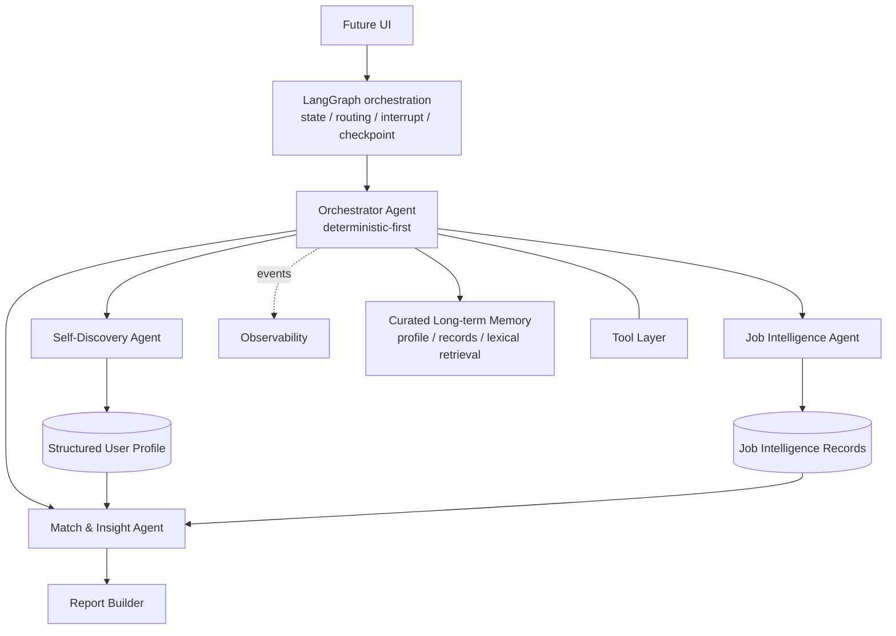

# Orange

> AI Career Discovery Agent for University Students
> 面向大学生的 AI 职业探索 Agent

**当前状态：Phase 7A — Structured & Persistent Memory**

Orange 是一个严肃的作品集项目，帮助大学生在职业选择中形成更清晰、可解释、可行动的判断。它遵循一个简单原则：**先理解自己，再理解工作，最后做职业决策。**

Orange 不是香港城市大学官方产品。首个演示场景计划使用经过脱敏的 CityU 硕士生背景，但产品和架构面向不同大学、地区与专业复用。

## 问题 Problem

学生常看到职位名称、热门榜单或技能清单，却仍难以回答：自己真正擅长什么、一个岗位每天实际做什么、适配与摩擦点在哪里，以及下一步该采取什么行动。单一排名和不透明推荐容易把推测包装成事实，也忽略个人兴趣、价值观与成长空间。

## 产品概念 Product Concept

Orange 计划把用户陈述、课程与项目证据整理成可确认的结构化画像，再以一致方式解释候选角色，最后生成带证据的适配洞察、能力缺口和行动建议。用户始终可以确认、修改或补充画像；系统展示多维证据关系，不用总体匹配分数或岗位排名替用户做决定。

## 预期工作流 Intended Workflow

1. 用户输入背景信息。
2. Orchestrator Agent 启动工作流。
3. Self-Discovery Agent 分析陈述与证据。
4. 系统生成结构化 `UserProfile`。
5. **用户确认、修改或补充画像。**
6. Job Intelligence Agent 分析候选职业角色。
7. Match & Insight Agent 比较画像与角色。
8. Report Builder 生成职业洞察与行动计划。
9. 用户提出后续问题。
10. 长期画像记忆在用户授权下影响后续对话。

## 系统架构预览 System Architecture



详细设计见 [ARCHITECTURE.md](ARCHITECTURE.md)，概念数据契约见 [DATA_CONTRACTS.md](DATA_CONTRACTS.md)。

## 四个核心 Agent 角色

- **Self-Discovery Agent**：从用户、课程与项目证据中形成候选技能、兴趣、价值观、优势、发展领域和目标，并生成可追溯的 `UserProfile`。
- **Job Intelligence Agent**：规范化职业信息，解释实际工作、能力要求、发展路径、优缺点和工作方式。
- **Match & Insight Agent**：比较用户与角色，生成有证据支持的适配解释、潜在摩擦、能力缺口和行动建议。
- **Orchestrator Agent**：以确定性状态转换为主，管理流程、路由、校验、重试、错误和结果聚合；它不是完全自治的 LLM Agent。

## 隐私、安全与责任

- 仓库按公开项目标准设计，不提交真实学号、联系方式、账号标识或任何 API/token。
- 真实个人数据与公开演示 fixture 严格分离；公开数据必须去标识化。
- 重要结论区分明确事实、观察证据、模型推断与建议。
- 产品不进行心理诊断，不保证就业结果，不自动投递职位。
- 可观测性只展示 execution trace、事件、证据与结构化 decision summary，不展示隐藏 chain-of-thought。

## 项目状态 Project Status

### 已实现 Implemented

- Pydantic 领域模型、证据 provenance 与安全 JSON 序列化；
- 可版本化、可修订、可确认的 `UserProfile`；
- 普通 Python 实现的显式状态机和 deterministic-first Orchestrator；
- 四个核心 Agent 概念；三个推理 Agent 均通过 `LLMProvider` 注入并由确定性代码约束；
- 本地 Course／Job fixture provider 与确定性 Report Builder；
- 不可跳过的画像确认门、修订返回路径和非法转换拒绝；
- 内存 `AgentEvent`／`ToolEvent` 与安全 routing summary；
- 三门虚构课程、20 条 Fictional Demo Job Records 和匿名用户 fixture；
- 离线 Demo 与 pytest 测试；
- provider-independent `LLMProvider` 严格结构化生成契约；
- 完全离线的 `FakeLLMProvider`；
- Alibaba Cloud Model Studio OpenAI-compatible `QwenProvider`；
- `ProfileSignalExtraction`、严格 Pydantic schema 与 evidence-ID 白名单校验；
- `profile_signal_extraction@v1` 版本化中文 Prompt；
- timeout／429／连接／5xx 的有限重试与安全错误归一化；
- token usage、latency、prompt metadata 与 retry count 的 credential-safe wrapper；
- 默认不联网的 Phase 2 Provider Demo；
- `self_discovery@v2` 中文结构化 Prompt：使用证据支持的最窄专业标签，并显式区分 career／project／learning goals；v1 保留为不可变历史；
- 确定性 `SourceEvidenceBuilder`、evidence whitelist 和 `ProfileAssembler`；
- 明确事实／证据推断区分、职业偏好、不确定性与 0–5 个澄清问题；
- 保守 development-area 规则：缺少证据绝不自动视为弱点；
- provider-injected `SelfDiscoveryAgent`、安全事件与不可跳过的画像确认门；
- Git-ignored 私有 Golden Case 路径，以及完全公开安全的离线测试路径。
- 六类轻量 `RoleFamily` taxonomy 与 Mainland China／Hong Kong／Macau／Taiwan 地理元数据；
- 确定性 `JobEvidenceBuilder`、严格 `JobIntelligenceExtraction` 和 evidence-ID 白名单；
- 确定性 `JobIntelligenceAssembler`，保留岗位事实／证据推断、confidence 与不确定性；
- provider-injected `JobIntelligenceAgent`、安全事件与 20-role 公共离线 Demo；
- salary、晋升、work-life、remote policy、team size 与完整技术栈缺失时明确保持 unknown。
- Qwen `qwen3.8-flash` non-thinking live 语义验证已覆盖产品、工程与分析三类代表角色。
- confirmed-profile Match 硬门与最小化 `MatchContextBuilder`；
- `MatchDimension`／`MatchRelationType` taxonomy，以及双向 `MatchEvidenceLink`；
- 明确区分 strong／partial alignment、evidence missing、confirmed gap、experience-depth gap、preference alignment、potential friction 与 unknown；
- 确定性 `MatchInsightAssembler` 与 evidence-linked `ActionItem` 安全策略；
- 仅描述覆盖情况的 metrics，不计算 overall match score、适配百分比或岗位排名；
- 使用公开合成 confirmed profile 的 all-20 offline Match Demo。
- LangGraph 编排层与显式 `OrangeGraphState`，同时保留原有确定性 workflow engine；
- 真实 `interrupt`／`Command(resume=...)` 画像审阅门、同一 thread identity 恢复和领域模型确认／修订语义；
- 自动测试／短期 Demo 使用内存 checkpoint，手动本地恢复使用 Git-ignored SQLite checkpoint；
- provider-independent Agent nodes、确定性 routing、安全失败状态与 graph execution events；
- public FakeLLMProvider Demo 可在暂停后恢复，并可跨 SQLite runner 重建继续执行。
- 独立 `StructuredProfileStore`，只保存 confirmed `UserProfile`，保留不可变版本历史与显式 current pointer；
- curated `MemoryRecord`、candidate／confirmed／superseded／archived lifecycle，以及显式 user-feedback confirmation；
- 独立 Git-ignored SQLite long-term memory DB、subject isolation、transactional hard purge；
- deterministic exact／lexical retrieval，结果保留 authority、provenance、confidence 与 supersedes metadata；
- LangGraph 在显式 profile confirmation 后可通过注入的 `MemoryService` 幂等保存画像；默认 workflow policy 不自动跳过 review；
- 不保存完整 chat transcript，不使用 embedding、sqlite-vec、Chroma 或任何 vector retrieval。

Phase 5 的 Match & Insight 从证据关系开始，不从分数开始。`evidence_missing` 只表示当前画像缺少验证材料，绝不自动变成能力弱或 `confirmed_gap`。结果保持原始 dataset／用户选择顺序，不选择最佳角色。

`GoalType` 将职业目标、项目交付目标和学习目标分开保存。项目目标可以作为项目／经验证据，但不会仅凭自身自动成为职业偏好或职业匹配结论。

Phase 2 provider live gate 已通过。Phase 3 的 Self-Discovery 由 LLM 提取候选信号，但权威 `UserProfile` 始终由确定性 Python 组装并保持 draft，等待用户确认。

### 计划中 Planned

- Phase 7B semantic/vector retrieval；
- Streamlit UI；
- 真实职位来源和脱敏课程导出 adapter。

## Roadmap（计划中，非已完成）

- Phase 1：领域模型与确定性工作流骨架（当前已实现）
- Phase 2：LLM Provider 抽象与首次结构化调用（完成）
- Phase 3：Evidence-Backed Self-Discovery Agent（完成）
- Phase 4：Job Intelligence Agent + Demo Role Taxonomy（完成）
- Phase 5：Evidence-Based Match & Insight Engine（完成）
- Phase 6：LangGraph Workflow Integration + Human-in-the-Loop Orchestration（完成）
- Phase 7A：Structured & Persistent Memory（当前已实现）
- Phase 7B：Semantic／Vector Retrieval（计划中）
- Phase 8：Observability
- Phase 9–10：Streamlit UI 与课程数据适配器
- Phase 11–13：测试、成本控制、演示案例与最终打磨

约 15 天能力里程碑见 [IMPLEMENTATION_PLAN.md](IMPLEMENTATION_PLAN.md)，学习路径见 [LEARNING_PLAN.md](LEARNING_PLAN.md)。未经明确批准，不进入 Phase 7B。

## 本地验证 Local Validation

目标运行环境为 Python 3.10+，当前本地开发环境为 Python 3.11。Phase 3 沿用 Pydantic、pytest、OpenAI-compatible transport SDK 与 python-dotenv：

```bash
python3 -m venv .venv
.venv/bin/python -m pip install -r requirements.txt
.venv/bin/python -m pytest
.venv/bin/python app.py
.venv/bin/python -m workflows.demo
.venv/bin/python -m providers.demo
.venv/bin/python -m agents.self_discovery_demo
.venv/bin/python -m agents.job_intelligence_demo
.venv/bin/python -m agents.match_insight_demo
.venv/bin/python -m workflows.langgraph_demo
.venv/bin/python -m workflows.langgraph_demo --checkpoint sqlite --sqlite-action start
# 使用上一条命令输出的 workflow_id：
.venv/bin/python -m workflows.langgraph_demo --checkpoint sqlite --sqlite-action resume --workflow-id <workflow_id>
.venv/bin/python -m memory.demo
```

Phase 6 LangGraph Demo 默认使用公开 fixture、`FakeLLMProvider` 和内存 checkpoint，全程离线。SQLite 模式只保存恢复当前工作流所需的执行状态到 `data/private/runtime/orange_workflow.sqlite3`；它不是长期记忆、向量记忆或用户历史检索。不得打印完整私有输入、raw request、完整 Prompt 或配置值。

Phase 7A public memory Demo 默认使用临时 SQLite 文件、synthetic subject、公开合成 confirmed profile 与 synthetic MemoryRecords，不读取或迁移 private Golden Case。显式 `--persistent-memory` 才会使用 `data/private/memory/orange_memory.sqlite3`。Workflow checkpoint 和 long-term memory 使用不同数据库；memory retrieval 的相关性不会改变记录的 authority status。
