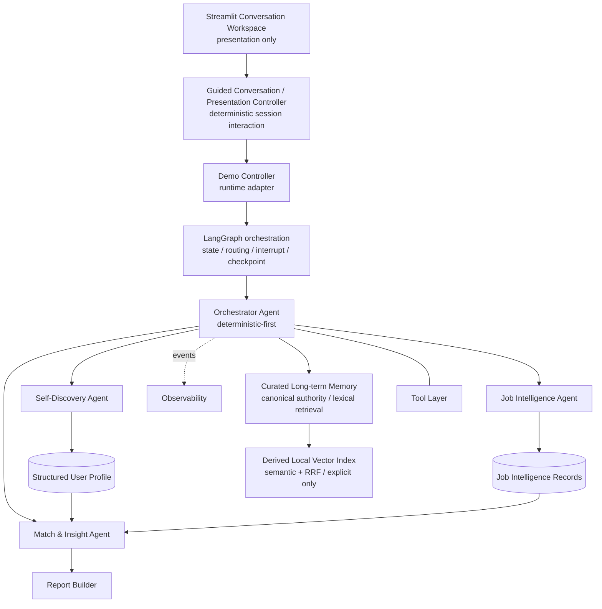

# Orange

> AI Career Discovery Agent for University Students
> 面向大学生的 AI 职业探索 Agent

**当前状态：Phase 8B — Safe Observability & Diagnostics（本地、离线、安全结构化事件）；Phase 8A 已建立本地 checkpoint `e707063`。Phase 8B 修改等待明确批准提交。**

Orange 是一个严肃的作品集项目，帮助大学生在职业选择中形成更清晰、可解释、可行动的判断。它遵循一个简单原则：**先理解自己，再理解工作，最后做职业决策。**

Orange 不是香港城市大学官方产品。首个演示场景计划使用经过脱敏的 CityU 硕士生背景，但产品和架构面向不同大学、地区与专业复用。

## 问题 Problem

学生常看到职位名称、热门榜单或技能清单，却仍难以回答：自己真正擅长什么、一个岗位每天实际做什么、适配与摩擦点在哪里，以及下一步该采取什么行动。单一排名和不透明推荐容易把推测包装成事实，也忽略个人兴趣、价值观与成长空间。

## 产品概念 Product Concept

Orange 计划把用户陈述、课程与项目证据整理成可确认的结构化画像，再以一致方式解释候选角色，最后生成带证据的适配洞察、能力缺口和行动建议。用户始终可以确认、修改或补充画像；系统展示多维证据关系，不用总体匹配分数或岗位排名替用户做决定。

## 预期工作流 Intended Workflow

1. 用户输入背景信息。
2. Orchestrator Agent 启动工作流。
3. Self-Discovery Agent 分析陈述与证据。
4. 系统生成结构化 `UserProfile`。
5. **用户确认、修改或补充画像。**
6. Job Intelligence Agent 分析候选职业角色。
7. Match & Insight Agent 比较画像与角色。
8. Report Builder 生成职业洞察与行动计划。
9. 用户提出后续问题。
10. 长期画像记忆在用户授权下影响后续对话。

## 系统架构预览 System Architecture



详细设计见 [ARCHITECTURE.md](ARCHITECTURE.md)，概念数据契约见 [DATA_CONTRACTS.md](DATA_CONTRACTS.md)。

## 四个核心 Agent 角色

- **Self-Discovery Agent**：从用户、课程与项目证据中形成候选技能、兴趣、价值观、优势、发展领域和目标，并生成可追溯的 `UserProfile`。
- **Job Intelligence Agent**：规范化职业信息，解释实际工作、能力要求、发展路径、优缺点和工作方式。
- **Match & Insight Agent**：比较用户与角色，生成有证据支持的适配解释、潜在摩擦、能力缺口和行动建议。
- **Orchestrator Agent**：以确定性状态转换为主，管理流程、路由、校验、重试、错误和结果聚合；它不是完全自治的 LLM Agent。

## 隐私、安全与责任

- 仓库按公开项目标准设计，不提交真实学号、联系方式、账号标识或任何 API/token。
- 真实个人数据与公开演示 fixture 严格分离；公开数据必须去标识化。
- 重要结论区分明确事实、观察证据、模型推断与建议。
- 产品不进行心理诊断，不保证就业结果，不自动投递职位。
- 可观测性只展示 execution trace、事件、证据与结构化 decision summary，不展示隐藏 chain-of-thought。

## 项目状态 Project Status

### 已实现 Implemented

- Pydantic 领域模型、证据 provenance 与安全 JSON 序列化；
- 可版本化、可修订、可确认的 `UserProfile`；
- 普通 Python 实现的显式状态机和 deterministic-first Orchestrator；
- 四个核心 Agent 概念；三个推理 Agent 均通过 `LLMProvider` 注入并由确定性代码约束；
- 本地 Course／Job fixture provider 与确定性 Report Builder；
- 不可跳过的画像确认门、修订返回路径和非法转换拒绝；
- 内存 `AgentEvent`／`ToolEvent` 与安全 routing summary；
- 三门虚构课程、20 条 Fictional Demo Job Records 和匿名用户 fixture；
- 离线 Demo 与 pytest 测试；
- provider-independent `LLMProvider` 严格结构化生成契约；
- 完全离线的 `FakeLLMProvider`；
- Alibaba Cloud Model Studio OpenAI-compatible `QwenProvider`；
- `ProfileSignalExtraction`、严格 Pydantic schema 与 evidence-ID 白名单校验；
- `profile_signal_extraction@v1` 版本化中文 Prompt；
- timeout／429／连接／5xx 的有限重试与安全错误归一化；
- token usage、latency、prompt metadata 与 retry count 的 credential-safe wrapper；
- 默认不联网的 Phase 2 Provider Demo；
- `self_discovery@v2` 中文结构化 Prompt：使用证据支持的最窄专业标签，并显式区分 career／project／learning goals；v1 保留为不可变历史；
- 确定性 `SourceEvidenceBuilder`、evidence whitelist 和 `ProfileAssembler`；
- 明确事实／证据推断区分、职业偏好、不确定性与 0–5 个澄清问题；
- 保守 development-area 规则：缺少证据绝不自动视为弱点；
- provider-injected `SelfDiscoveryAgent`、安全事件与不可跳过的画像确认门；
- Git-ignored 私有 Golden Case 路径，以及完全公开安全的离线测试路径。
- 六类轻量 `RoleFamily` taxonomy 与 Mainland China／Hong Kong／Macau／Taiwan 地理元数据；
- 确定性 `JobEvidenceBuilder`、严格 `JobIntelligenceExtraction` 和 evidence-ID 白名单；
- 确定性 `JobIntelligenceAssembler`，保留岗位事实／证据推断、confidence 与不确定性；
- provider-injected `JobIntelligenceAgent`、安全事件与 20-role 公共离线 Demo；
- salary、晋升、work-life、remote policy、team size 与完整技术栈缺失时明确保持 unknown。
- Qwen `qwen3.8-flash` non-thinking live 语义验证已覆盖产品、工程与分析三类代表角色。
- confirmed-profile Match 硬门与最小化 `MatchContextBuilder`；
- `MatchDimension`／`MatchRelationType` taxonomy，以及双向 `MatchEvidenceLink`；
- 明确区分 strong／partial alignment、evidence missing、confirmed gap、experience-depth gap、preference alignment、potential friction 与 unknown；
- 确定性 `MatchInsightAssembler` 与 evidence-linked `ActionItem` 安全策略；
- 仅描述覆盖情况的 metrics，不计算 overall match score、适配百分比或岗位排名；
- 使用公开合成 confirmed profile 的 all-20 offline Match Demo。
- LangGraph 编排层与显式 `OrangeGraphState`，同时保留原有确定性 workflow engine；
- 真实 `interrupt`／`Command(resume=...)` 画像审阅门、同一 thread identity 恢复和领域模型确认／修订语义；
- 自动测试／短期 Demo 使用内存 checkpoint，手动本地恢复使用 Git-ignored SQLite checkpoint；
- provider-independent Agent nodes、确定性 routing、安全失败状态与 graph execution events；
- public FakeLLMProvider Demo 可在暂停后恢复，并可跨 SQLite runner 重建继续执行。
- 独立 `StructuredProfileStore`，只保存 confirmed `UserProfile`，保留不可变版本历史与显式 current pointer；
- curated `MemoryRecord`、candidate／confirmed／superseded／archived lifecycle，以及显式 user-feedback confirmation；
- 独立 Git-ignored SQLite long-term memory DB、subject isolation、transactional hard purge；
- deterministic exact／lexical retrieval，结果保留 authority、provenance、confidence 与 supersedes metadata；
- LangGraph 在显式 profile confirmation 后可通过注入的 `MemoryService` 幂等保存画像；默认 workflow policy 不自动跳过 review；
- 不保存完整 chat transcript；Phase 7A canonical Memory DB 仍不包含 vector table。
- Orange Interactive Demo v0.2：中文优先、conversation-first 的 Streamlit workspace，使用公开合成 persona、`FakeLLMProvider`、session-scoped in-memory checkpoint 与 temporary memory DB；
- 确定性引导问题、随回答演进且区分「已有证据／用户刚刚表达／待确认／尚不确定」的动态职业画像；
- Profile Confirm 使用真实 LangGraph interrupt／resume 和同一 thread，Self-Discovery 不因 Streamlit rerun 重跑；
- 确认后才展示 AI Product Intern、AI Application Engineer、Data Analyst 三个「值得探索的方向」，不计算分数或排名；
- role clarification 可仅用于当前 session，也可经明确选择保存为 confirmed Demo `USER_FEEDBACK`；
- Match Insights 保留八类关系，Action Plan 使用 Why／What／Evidence／Status 任务卡，结尾提供无评分的 Career Exploration Map；
- 「Orange 对你的长期理解」只显示已确认画像、active confirmed feedback 与真实画像历史；另有可折叠安全 trace 和 session-isolated Reset Demo。
- `EmbeddingProvider` 抽象与 deterministic `FakeEmbeddingProvider`；normal pytest 不加载模型、不联网；
- local-only FastEmbed adapter，选择 384-d `paraphrase-multilingual-MiniLM-L12-v2`，model-specific query／passage 行为封装在 provider 内；
- canonical `orange_memory.sqlite3` 继续使用 stdlib sqlite3；separate derived `orange_vectors.sqlite3` 只使用 pysqlite3 + sqlite-vec；
- active confirmed-only indexing、content hash／model identity metadata、subject isolation、lifecycle sync、stale-vector canonical revalidation、rebuild 与 coordinated purge；
- 原有 deterministic lexical retriever 保留；semantic + lexical 通过固定一基 RRF `k=60` 融合并保留 lexical／semantic／fusion rank；
- `MemoryContextBuilder` 生成 bounded structured authoritative context，但不自动注入 Self-Discovery、Job Intelligence、Match 或 LangGraph。
- `MemoryUseCase` 与 deterministic `MemoryContextPolicy` 只开放 `PROFILE_REFINEMENT`、`ROLE_EXPLORATION`；每个 use case 固定 type allowlist、hybrid mode、top-k、record／character budget 与唯一 consumer；
- Profile refinement 把「当前会话最新表达」「confirmed profile」「active confirmed historical Memory」保持为三层 authority，产出 draft profile，仍须单独 Profile Review；
- Role Deep Dive 通过「🍊 Orange 记得／来自你之前确认的信息／查看依据」显示有 `memory_refs` 的 recall，不修改岗位事实或 `MatchResult`；
- 只有带 `signal_dimension`／`signal_value`／`signal_version` 的结构化同维度 Memory 才能建立 session-only `MemoryChangeCandidate`；semantic similarity 不判断冲突；
- 只有用户明确确认才可创建／supersede long-term Memory；retrieval、defer 与 uncertain 路径都不写 canonical DB。

Phase 5 的 Match & Insight 从证据关系开始，不从分数开始。`evidence_missing` 只表示当前画像缺少验证材料，绝不自动变成能力弱或 `confirmed_gap`。结果保持原始 dataset／用户选择顺序，不选择最佳角色。

`GoalType` 将职业目标、项目交付目标和学习目标分开保存。项目目标可以作为项目／经验证据，但不会仅凭自身自动成为职业偏好或职业匹配结论。

Phase 2 provider live gate 已通过。Phase 3 的 Self-Discovery 由 LLM 提取候选信号，但权威 `UserProfile` 始终由确定性 Python 组装并保持 draft，等待用户确认。

### 计划中 Planned

- Agent-aware memory context integration（只有 retrieval quality 继续验证后才考虑）；
- 后续生产级 UI／认证／部署（Interactive Demo v0.2 不代表最终前端架构）；
- 真实职位来源和脱敏课程导出 adapter。

## Orange Interactive Demo v0.2

本地运行：

```bash
.venv/bin/streamlit run ui/app.py
```

默认模式是 **Public Synthetic Demo**：只使用公开虚构学生／岗位 fixture、`FakeLLMProvider`、内存 LangGraph checkpoint 与临时 SQLite memory。它不会读取私有 Golden Case、`.env.local`、persistent workflow DB 或 persistent memory DB，也不会调用外部模型或职位 API。

Demo 先通过选择题、多选和可选短文本进行 guided discovery，右侧动态画像同步区分证据、表达、待确认和未知；画像确认仍使用真实 LangGraph interrupt／resume。确认后才进入三个固定职业方向，继续完成 role clarification、evidence-based Match、任务式 Action Plan、Career Exploration Map 与明确确认的 Demo Memory feedback。它不是自由聊天机器人或生产 UI，不包含实时职位数据，也不会默认分析真实用户。

## Roadmap（已完成与后续计划分开标记）

- Phase 1：领域模型与确定性工作流骨架（当前已实现）
- Phase 2：LLM Provider 抽象与首次结构化调用（完成）
- Phase 3：Evidence-Backed Self-Discovery Agent（完成）
- Phase 4：Job Intelligence Agent + Demo Role Taxonomy（完成）
- Phase 5：Evidence-Based Match & Insight Engine（完成）
- Phase 6：LangGraph Workflow Integration + Human-in-the-Loop Orchestration（完成）
- Phase 7A：Structured & Persistent Memory（完成）
- Phase 7.5：Orange Interactive Demo Vertical Slice（完成并建立本地 checkpoint）
- Phase 7.6：Conversation-First Product Redesign / Demo v0.2（完成并建立本地 checkpoint）
- Phase 7B：Semantic & Hybrid Memory Retrieval（完成并建立本地 checkpoint）
- Phase 7C：Context-Aware Memory Integration（完成，本地 checkpoint `1c64e7a`）
- Phase 8A：Evaluation Framework（完成，本地 checkpoint `e707063`）
- Phase 8A.1：optional live evaluation（未开始，必须另行授权）
- Phase 8B：Safe Observability & Diagnostics（已实现，本地验收；未提交）
- Phase 8C：polish；8D：public readiness（均未开始）
- Phase 9–10：Streamlit UI 与课程数据适配器
- Phase 11–13：测试、成本控制、演示案例与最终打磨

约 15 天能力里程碑见 [IMPLEMENTATION_PLAN.md](IMPLEMENTATION_PLAN.md)，学习路径见 [LEARNING_PLAN.md](LEARNING_PLAN.md)。未经明确批准，不进入后续阶段。

## Phase 8A Golden Evaluation

```bash
.venv/bin/python -m evaluation.run
.venv/bin/python -m evaluation.run --scenario SD_002
.venv/bin/python -m evaluation.run --capability memory --tag offline
```

三个 evaluation layers 覆盖 Self-Discovery、Job Intelligence、Match、Memory、Conversation、Action 与端到端旅程。27 个公开合成场景不读取私有 Golden Case、不调用 Qwen/cloud embedding、不引入 LLM judge 或总体质量分。PASS、FAIL、EXPECTED_UNCERTAINTY、NEEDS_REVIEW 由 required/forbidden/provenance 等结构规则确定；未知被正确保留时是成功，而不是系统失分。

生成安全 JSON 和 failures-first Markdown 到 Git-ignored `artifacts/evaluation/`。结果：20 PASS、7 EXPECTED_UNCERTAINTY、0 FAIL、0 NEEDS_REVIEW。完整使用、状态推导、taxonomy、范围局限与 CLI exit code 见 [evaluation/README.md](evaluation/README.md)。Fake-only suite 不是 live model benchmark，也不能证明任意语言的语义正确性。

## Phase 8B 安全诊断

在 public synthetic Demo 中展开默认折叠的「开发者执行轨迹（安全）」，查看 Run Summary、Workflow Timeline、Component Activity、Memory Activity、Match Diagnostics、Warnings / Failures 与 Raw Safe Events。只有 opaque ID、closed category、status、count、版本、可用时的 token usage 与实测 duration；没有 evidence text、profile JSON、Memory content、query、Prompt、completion、embedding、credential 或隐藏推理。

`observability/` 是 session-local observer，不是数据库、遥测 exporter 或评分器。Profile Review interrupt/resume 使用同一 diagnostic run；渲染不生成事件，Reset 清空旧 collector 并创建新 identity。Golden evaluation 每个 scenario 独立 run，只在报告中保存 bounded run/event references，不嵌入 trace。未知是正常产品状态，不自动成为诊断 warning。

全程无需新增服务、环境变量或依赖。离线测试与 Demo 使用 Fake providers；Qwen instrumentation 仅通过 transport stub 测试，没有 live 请求。使用与限制见 [observability/README.md](observability/README.md)。Phase 8C/8D 未授权、未实现；不自动提交或 push。

## 本地验证 Local Validation

目标运行环境为 Python 3.10+，当前本地开发环境为 Python 3.11。Phase 3 沿用 Pydantic、pytest、OpenAI-compatible transport SDK 与 python-dotenv：

```bash
python3 -m venv .venv
.venv/bin/python -m pip install -r requirements.txt
.venv/bin/python -m pytest
.venv/bin/python app.py
.venv/bin/python -m workflows.demo
.venv/bin/python -m providers.demo
.venv/bin/python -m agents.self_discovery_demo
.venv/bin/python -m agents.job_intelligence_demo
.venv/bin/python -m agents.match_insight_demo
.venv/bin/python -m workflows.langgraph_demo
.venv/bin/python -m workflows.langgraph_demo --checkpoint sqlite --sqlite-action start
# 使用上一条命令输出的 workflow_id：
.venv/bin/python -m workflows.langgraph_demo --checkpoint sqlite --sqlite-action resume --workflow-id <workflow_id>
.venv/bin/python -m memory.demo
.venv/bin/python -m memory.semantic_demo
# 模型已明确下载并缓存后，完全本地运行：
HF_HUB_OFFLINE=1 .venv/bin/python -m memory.local_embedding_validation
.venv/bin/streamlit run ui/app.py
```

Phase 6 LangGraph Demo 默认使用公开 fixture、`FakeLLMProvider` 和内存 checkpoint，全程离线。SQLite 模式只保存恢复当前工作流所需的执行状态到 `data/private/runtime/orange_workflow.sqlite3`；它不是长期记忆、向量记忆或用户历史检索。不得打印完整私有输入、raw request、完整 Prompt 或配置值。

Phase 7A public memory Demo 默认使用临时 SQLite 文件、synthetic subject、公开合成 confirmed profile 与 synthetic MemoryRecords，不读取或迁移 private Golden Case。显式 `--persistent-memory` 才会使用 `data/private/memory/orange_memory.sqlite3`。Workflow checkpoint 和 long-term memory 使用不同数据库；memory retrieval 的相关性不会改变记录的 authority status。

Phase 7.6 Streamlit Demo 继续完全离线：每个 browser session 拥有独立 controller、deterministic guided-conversation state、`InMemorySaver`、opaque workflow/subject IDs 与 temporary memory DB。Conversation state 只负责产品交互；UI 仍只映射已验证 domain output，不重新实现 Self-Discovery、Job Intelligence、Match、actions、memory authority 或 graph routing。角色澄清默认只留在 session，只有用户选择「保存」时才进入该 session 的 temporary Demo Memory。

Phase 7B public semantic Demo 只建立 temporary canonical/vector DB 和 synthetic subject。默认使用 `FakeEmbeddingProvider`；real-model validation 是单独、显式、cache-only 的命令。Embedding dependency／public model 下载可以联网，但 runtime retrieval 不调用云端，任何 private profile、Memory、query、向量或凭据都不会上传。删除 derived vector DB 不影响 canonical profile／Memory，并可通过 `rebuild_subject_index()` 从 active confirmed records 重建。

公开模型默认缓存到 `~/.cache/orange/fastembed`，不进入仓库。`LocalEmbeddingProvider` 默认 `allow_download=False`；正常 runtime 若缓存缺失会安全失败，不会静默联网。

Phase 7C public Demo 仍使用公开合成 persona、`FakeLLMProvider` 与 `FakeEmbeddingProvider`。打开角色时，UI 才通过明确的 `ROLE_EXPLORATION` policy 构造 bounded context；Job Intelligence 和 Match pipeline 没有 Memory consumer。AI Product Intern 提供结构化偏好变化场景：当前表达先用于 session，只有明确选择更新才 supersede 旧 Memory；随后生成的 profile v2 仍是 draft，必须单独确认。没有 Qwen、cloud embedding、private Golden Case、private Memory 或 live job 调用。
