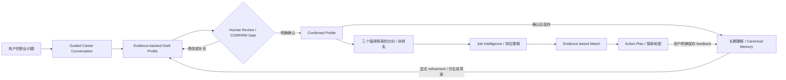
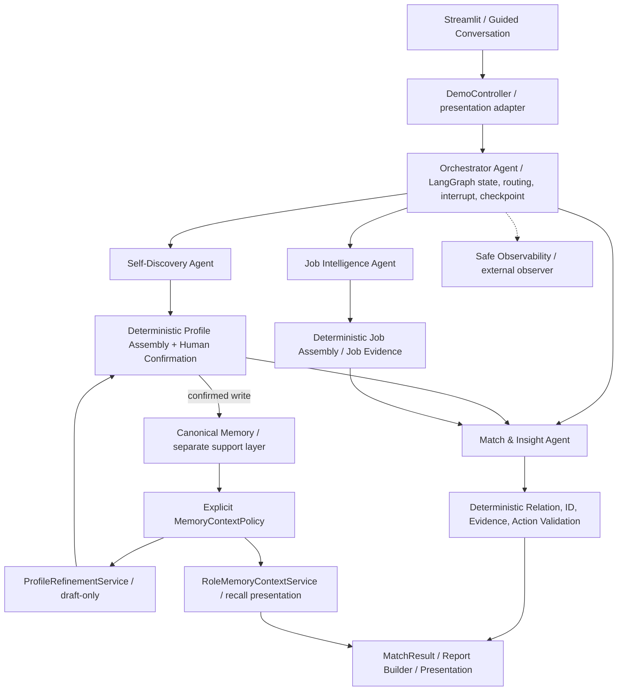
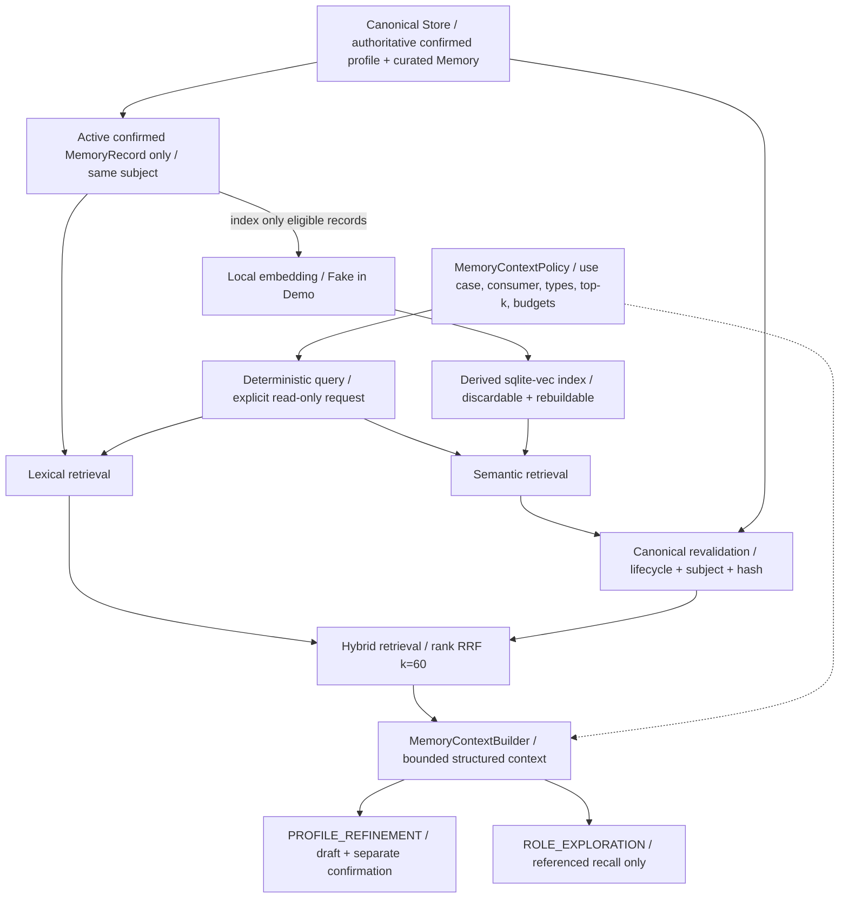

# 🍊 Orange

> AI Career Discovery Agent for University Students · 面向大学生的 AI 职业探索 Agent

通过引导式对话，把经历整理成可确认的职业画像，理解岗位的实际工作，再用证据比较方向、制定下一步行动。

**先理解自己，再理解工作，最后做职业决策。** Orange 不替你选「最佳岗位」，不做总体适配分数或岗位排名；缺少证据，也不等于你不具备能力。

[产品体验](#product-experience) · [本地 Demo](#demo) · [架构](#architecture) · [Evaluation](#evaluation) · [运行](#run-locally) · [文档](#documentation)

**Hero 截图待用户选择：**建议展示公开合成 Demo 的「对话 + 动态职业画像」工作区。当前没有截图资产；[截图计划](docs/SCREENSHOT_PLAN.md)说明状态、裁剪与隐私边界。

## Orange 是什么，为什么做

面对相似的岗位名称和技能清单，学生仍可能不知道：哪段经历能说明自己的能力？岗位每天实际做什么？哪些是已有交集，哪些只是兴趣，哪些还需要材料验证？

Orange 把这些问题连成一条可审阅的探索旅程。它是本地作品集 Demo，不是心理测评、就业保证或自动投递工具，也不是香港城市大学官方产品；产品和架构面向不同大学与专业。

<a id="product-experience"></a>
## 产品体验 Product Experience

1. **从一个职业问题开始。** 通过固定选项、多选及可选短文本聊经历、投入的活动、工作偏好和目标；不是开放式自由聊天。
2. **看到理解逐步形成。** 左侧对话，右侧动态画像；「已有证据／你刚刚表达／待确认／尚不确定」分开显示。
3. **由你校准画像。** 草案必须经过真实的人工审阅与确认门；修订后仍需重新确认。
4. **探索三个方向。** AI Product Intern、AI Application Engineer、Data Analyst 使用同一结构展示；固定顺序不是排名。
5. **看清岗位与自己。** 岗位事实、你的情况、来自已确认历史的「Orange 记得」分别呈现，再查阅可解析的双侧证据关系。
6. **把未知变成行动。** Action Plan 说明为什么做、具体做什么、要留下什么证据；行动状态只属于本次会话，完成不自动证明能力。
7. **保留经你确认的理解。** 明确保存 Demo feedback、查看当前画像与历史，或重置 Demo；新表达不会自动成为长期事实。

### Product Flow



确认前不会进入方向与匹配；「长期」是 Memory 能力的语义，当前浏览器 Demo 使用临时存储，不承诺跨次启动保留。

## 核心能力与差异

| 能力 | Orange 如何约束它 |
|---|---|
| Evidence-backed profile | 来源、置信度与不确定性，由用户确认 |
| Guided conversation | 固定阶段，不由 LLM 自由路由，不显示画像完整度百分比 |
| 证据关系而非分数 | 双侧信号与 evidence ownership 校验，未知不变弱点 |
| 有依据的行动 | exact target、关联 insight、确定性描述与预期证据 |
| 人工确认 Memory | immutable profile versions、curated lifecycle、subject isolation |
| Semantic / Hybrid retrieval | 本地 embedding、canonical revalidation、RRF；相关不等于真实 |
| Evaluation + safe diagnostics | 离线 Golden 检查产品边界，内容最小化事件解释执行过程 |

<a id="architecture"></a>
## 架构 Architecture

四个固定核心概念角色：**Orchestrator Agent** 管状态与确认门；三个语义 Agent 分别负责 Self-Discovery、Job Intelligence、Match & Insight。LLM 提出候选；确定性 Python 负责校验、组装、权威状态和行动渲染。Report Builder 不是第五个 Agent。

### Agent Architecture



Memory 只开放 `PROFILE_REFINEMENT` 与 `ROLE_EXPLORATION`；**Job Intelligence 与 Match relation generation 不消费 retrieved Memory**。检索到的历史不改变岗位事实，也不直接生成匹配关系。Provider abstraction 支持离线 Fake 与显式 Qwen adapter，默认 Demo 不调用真实模型。

### Memory Architecture



Policy 在检索前决定权限与范围，builder 在检索后执行数量／字符预算。相似度和 RRF 只决定相关顺序，不决定 authority 或职业适配。Canonical Memory 是事实来源；只索引 active confirmed MemoryRecord，不索引完整画像或聊天记录。向量索引可丢弃、重建，命中必须回查当前已确认记录。Workflow checkpoint 只恢复执行，是第三个独立边界。

更多：[系统架构](ARCHITECTURE.md) · [数据契约](DATA_CONTRACTS.md) · [Memory 实现说明](memory/README.md)。

## Evidence-based Match

八类关系分开展示：strong alignment、partial alignment、evidence missing、confirmed gap、experience depth gap、preference alignment、potential friction、unknown。

- `evidence_missing`：岗位要求已知，但当前画像缺少证明材料；不是能力不足。
- `confirmed_gap`：需要明确的限制证据；不能从缺失材料推出来。
- `preference_alignment`：兴趣／偏好支持探索方向，不证明专业能力或正式工作经验。
- `unknown`：信息不足，先保留问题；摩擦也不是「不适合」的职业裁决。

请求限定的 signal-ID schema、严格结构化输出、relation-aware validation、双侧 evidence resolver 与 deterministic action policy 共同约束候选。无自动语义修复、总体质量分、总体适配概率或「Best Role」。

<a id="evaluation"></a>
## Evaluation：质量证据与局限

Golden Suite 是生产系统外部 observer，覆盖 deterministic contracts、semantic Golden cases、end-to-end journeys。Self-Discovery、Job Intelligence、Match、Memory、Conversation、Action 都有公开合成场景。

| 本地验证 | 已核实结果 |
|---|---|
| Phase 8C 回归基线 | 783 passed / 0 failed |
| Phase 8D 本地最终回归 | 818 passed / 0 failed（保留 783；新增 35 项公开 readiness contracts） |
| Golden Suite | 27 scenarios：20 PASS / 7 EXPECTED_UNCERTAINTY / 0 FAIL / 0 NEEDS_REVIEW |

`EXPECTED_UNCERTAINTY` 是成功状态：证据不足时，系统正确拒绝给出更强结论。它不是部分失败，也不是为了隐藏失败设置的豁免。任何必要检查失败仍是 FAIL。

这些 Fake／synthetic 结果验证已定义契约和案例，不是 live-model benchmark、招聘效果证明或心理测评。没有 LLM judge、accuracy 百分比或总体 quality score。报告在 Git-ignored `artifacts/evaluation/`，不会作为公开输入或权威画像。详见 [Evaluation 说明](evaluation/README.md)。

## Safe Observability

底部默认折叠的「开发者执行轨迹（安全）」展示 timeline、component / Memory activity、生命周期、数量、版本、实测时长和可用时的 token usage。事件只允许 opaque IDs 与 closed categories；Reset 清理 session-local collector。

不记录 raw profile、evidence text、Memory content、query、Prompt、completion、向量、凭据或隐藏 chain-of-thought。不把诊断成功当职业结论，也没有云 telemetry。详见 [安全诊断](observability/README.md)。

<a id="demo"></a>
## Demo：公开、虚构、离线

默认 **Public Synthetic Demo** 使用公开合成 persona、20 条虚构岗位中的三个展示方向、`FakeLLMProvider`、`FakeEmbeddingProvider`、内存 LangGraph checkpoint 与 session 临时 SQLite stores。

不会加载 `.env.local`、私有 Golden Case、真实确认画像或私有持久 DB，不需要 API key，也不需要下载 embedding model。保存 feedback 仅影响本次 Demo 的临时 Memory；关停／Reset 后不承诺保留。请勿输入真实私人资料。

截图尚未拍摄；[六个截图目标](docs/SCREENSHOT_PLAN.md)与[产品 UX 验收](docs/PRODUCT_UX_ACCEPTANCE.md)可用于人工复核。Demo 是 guided workflow，不是无限自由聊天或生产级多用户服务。

<a id="run-locally"></a>
## Run Locally

在已取得的仓库副本中运行（尚无 remote，不提供虚构 clone URL）：

```bash
cd /path/to/orange-career-agent
python3.11 -m venv .venv
.venv/bin/python -m pip install -r requirements.txt
.venv/bin/streamlit run ui/app.py
```

打开终端显示的 localhost 地址。Python **3.11.9** 在本地已验证；当前验证平台为 macOS Apple Silicon。这不是全部操作系统兼容性承诺。已有有效 `.venv` 时可直接运行最后一行；不要覆盖含其他用途的环境。

安装依赖通常需要网络；**默认 Demo 和 automated tests 的运行不需要外部网络**，不加载真实模型。`requirements.txt` 同时包含 runtime 与 test dependencies，尚未拆成发布锁文件。

```bash
.venv/bin/python -m pytest -q
.venv/bin/python -m evaluation.run
```

Canonical Memory 使用标准库 `sqlite3`；独立 derived vector index 使用 `pysqlite3==0.6.0` + `sqlite-vec==0.1.9`（当前安装的间接依赖），为本地 extension loading 保留 binding 边界，**不全局替换 sqlite3**。

可选真实 embedding 集成使用 FastEmbed / ONNX、384-d `paraphrase-multilingual-MiniLM-L12-v2`，本地包元数据标为 Apache-2.0。默认 adapter cache-only，模型未缓存时安全失败；显式模型下载是另一项操作，不是 Demo／pytest 前置步骤。见 [Memory 说明](memory/README.md)与[第三方许可记录](docs/THIRD_PARTY_NOTES.md)。

## Project Structure

```text
orange-career-agent/
├── agents/          # 三个语义 Agent、确定性 assemblers、Report Builder
├── providers/       # LLM abstraction、Fake、显式 Qwen transport
├── config/prompts/  # 版本化 prompts（历史版本保留）
├── workflows/       # Orchestrator、LangGraph、人工确认与 checkpoints
├── memory/          # Canonical stores、local retrieval、显式 consumers
├── evaluation/      # 外部 Golden observer、合成场景、safe reports
├── observability/   # 最小化事件、session collector、安全 diagnostics
├── ui/              # Streamlit、presentation adapter、visual system
├── data/fixtures/   # 公开虚构数据；私有及 runtime 数据不提交
├── docs/            # 决策、验收、公开审查与截图计划
└── tests/           # Offline unit、contract、integration、AppTest
```

## Technical Decisions

Deterministic-first 让确认、引用和失败路径可测试；LangGraph 承担 interrupt／resume，不取代领域规则；provider injection 让业务不绑定 transport；canonical / derived / checkpoint 分离避免相关性越权。保持 Streamlit 和少量视觉 tokens，不为作品集包装重写前端。历史取舍见 [ADRs](docs/DECISIONS.md)。

## Privacy & Safety

`.env*`（仅 `.env.example` 空占位除外）、`data/private/`、`data/local/`、本地模型、evaluation / diagnostic artifacts 与 `.venv` 均不提交。公共 fixtures 是虚构素材，不是匿名化后可反推的真实学生画像。当前文件干净不代表历史干净，公开前必须审查全部 Git 历史；[本地审查记录](docs/PUBLIC_READINESS_AUDIT.md)说明范围与局限。

作者元数据会随 Git 历史公开；发布前由仓库所有者决定。截图只用合成 Demo，禁止真实姓名、学号、联系方式、私有材料、凭据与可识别本机路径。公开 readiness 不等于已发布。

## Current Scope & Limitations

已实现本地 guided discovery → 确认 → 岗位理解 → evidence-based Match → actions，以及显式 Memory、Golden Evaluation 和安全诊断。尚未实现认证、生产级多用户隔离服务、云部署、实时招聘、Canvas 在线集成、无约束对话或就业效果验证。Fake 输出不证明真实 LLM 的任意语义可靠性。

## Roadmap

Portfolio v1：核心能力、本地 Demo、Evaluation、诊断、UI polish 与 Phase 8D 公开入口整理已完成；发布仍等待用户决策，8D 修改尚未提交。[实施与阶段历史](IMPLEMENTATION_PLAN.md)保留工程演进，而非占据首页。

**Phase 9A — Web Deployment Readiness** 与 **Phase 9B — Public Web Deployment** 均未开始，必须单独授权。认证、真实模型模式、云数据和部署是否需要，属于未来决策，不是当前承诺。

<a id="documentation"></a>
## Documentation

| 入口 | 用途 |
|---|---|
| [Product Spec](PRODUCT_SPEC.md) | 当前产品边界与用户确认原则 |
| [Architecture](ARCHITECTURE.md) | 组件边界、数据流、当前与历史实现 |
| [Data Contracts](DATA_CONTRACTS.md) | 领域／抽取／Memory／Evaluation／诊断 contracts |
| [Implementation Plan](IMPLEMENTATION_PLAN.md) | 完成状态、阶段历史、未授权路线 |
| [Learning Plan](LEARNING_PLAN.md) | 工程概念与一个可选阅读／Demo 任务 |
| [Decisions](docs/DECISIONS.md) | 追加式 ADR 历史与取舍 |
| [Memory](memory/README.md) | Canonical / semantic / hybrid、显式 consumers |
| [Evaluation](evaluation/README.md) | Golden layers、状态、CLI 与限制 |
| [Observability](observability/README.md) | 安全事件与诊断边界 |
| [Product UX Acceptance](docs/PRODUCT_UX_ACCEPTANCE.md) | Phase 8C 的本地交互／布局验收 |
| [Public Release Checklist](docs/PUBLIC_RELEASE_CHECKLIST.md) | 每项 PASS／BLOCKED／用户决策 |
| [Portfolio Acceptance](docs/PORTFOLIO_ACCEPTANCE.md) | 公开阅读与工程故事审阅 |
| [Screenshot Plan](docs/SCREENSHOT_PLAN.md) | 人工截图目标与 asset 策略 |

深层模块 README／旧 ADR 中的 Phase 标签保留其历史上下文；当前能力和未来状态以本入口及根目录产品／架构说明为准。

## License

仓库目前没有 `LICENSE`。**USER DECISION REQUIRED**：由所有者选择许可后再发布；本阶段不默认授予开源使用权，也不自动选择 MIT 或 Apache。依赖和模型的许可证不是 Orange 自身的许可证。
